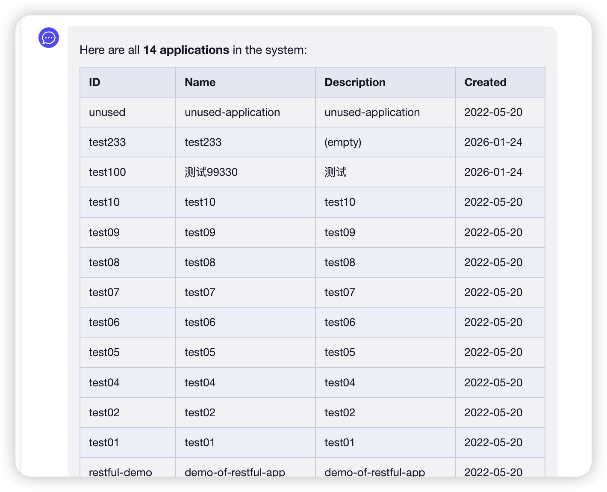
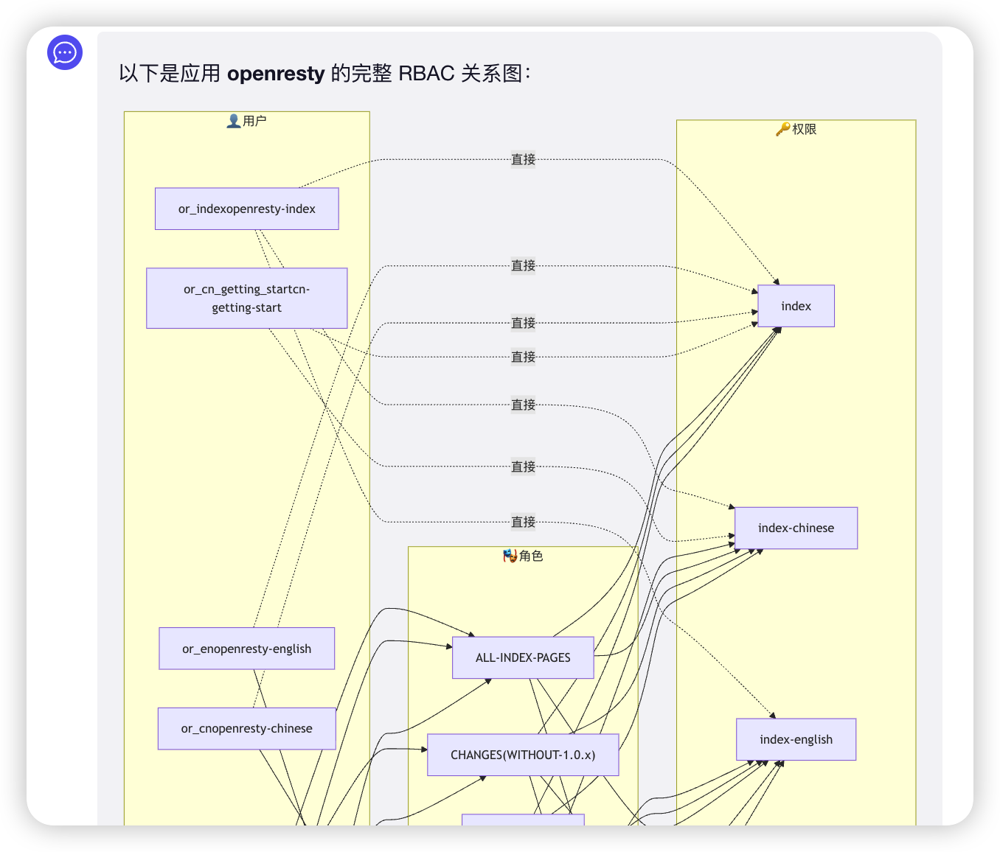
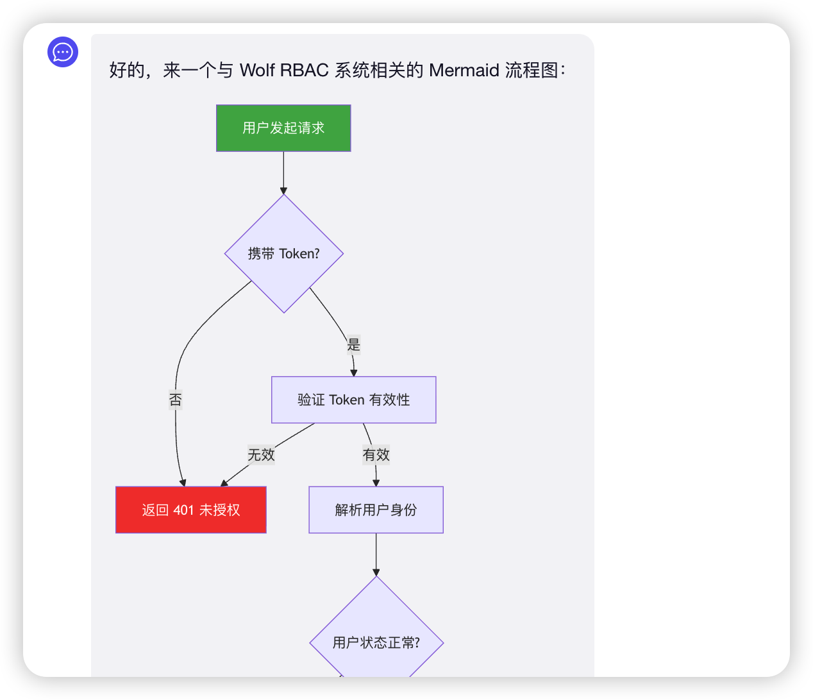
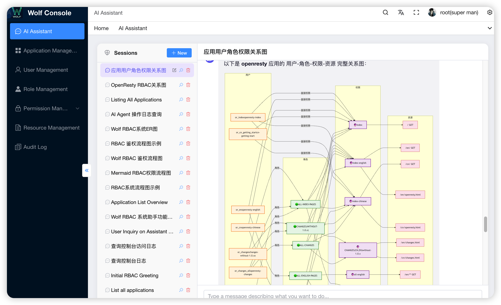
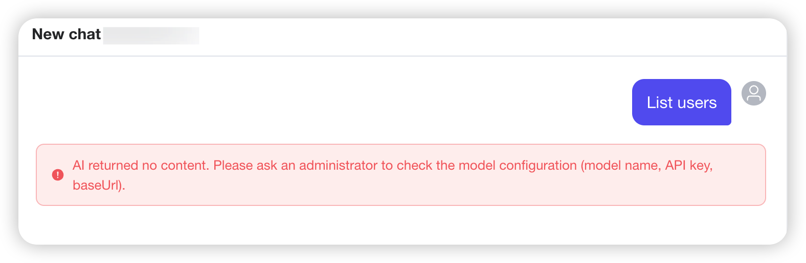

[English](README-AI-AGENT-EN.md) | [返回主 README](README-CN.md)

# Wolf AI Assistant

> 在 Wolf RBAC 控制台中，通过自然语言对话即可完成应用、用户、角色、权限、资源等 RBAC 对象的管理，让权限管理不再依赖逐个表单点击。

[](https://github.com/iGeeky/wolf/stargazers)
[](./LICENSE)

## 这是什么

`Wolf AI Assistant`（也称 Wolf AI Agent）是 Wolf 系统在 `0.8.x` 引入的一项新能力。它在 Console 中提供了一个 AI 对话窗口，让你可以用自然语言直接驱动 Wolf 现有的 RBAC 接口：

- 「帮我看一下 `oa-app` 应用下有哪些角色，每个角色绑了哪些权限。」
- 「在应用 `pi-mono` 下新增一个 `viewer` 角色，并把所有以 `read_` 开头的权限授给它。」
- 「最近 7 天 `admin` 用户在 `oa-app` 下的访问记录有没有失败的？」
- 「重置一下用户 `lily` 的密码，把新密码告诉我。」

AI 不是绕过 Wolf 现有的鉴权逻辑去操作数据库，而是通过 **Tool Calling** 调用 Wolf 自己的 Controller，复用现有的参数校验、权限检查、缓存刷新、审计日志等全部链路。所以：

- 它能做什么 = 当前登录用户在 Console 上能做什么。
- 它做了什么 = 全部进入 `access_log` 表，`appID = 'ai-agent'`，可审计、可追溯。

## 主要能力

### 1. 对话式 RBAC 管理

覆盖 Wolf 全部核心实体：

| 实体 | 工具数 | 工具名 |
|-----|------|------|
| Application（应用） | 6 | `list_applications` / `get_application` / `create_application` / `update_application` / `delete_application` / `get_rbac_diagram` |
| User（用户） | 5 | `list_users` / `create_user` / `update_user` / `delete_user` / `reset_user_password` |
| Role（角色） | 4 | `list_roles` / `create_role` / `update_role` / `delete_role` |
| Permission（权限） | 4 | `list_permissions` / `create_permission` / `update_permission` / `delete_permission` |
| Resource（资源） | 4 | `list_resources` / `create_resource` / `update_resource` / `delete_resource` |
| Category（分类） | 4 | `list_categories` / `create_category` / `update_category` / `delete_category` |
| UserRole（用户角色关联） | 3 | `get_user_roles` / `set_user_roles` / `delete_user_roles` |
| AccessLog（审计日志） | 1 | `query_access_logs` |

> 工具权限会按当前登录用户的角色自动裁剪。`admin` 用户看不到也调不了 `create_application` / `delete_user` / `reset_user_password` 等仅 `super` 才能执行的工具。

### 2. 多会话与会话管理

- 会话列表（侧边栏）：新建、切换、重命名、删除、AI 自动总结标题
- 历史回放：消息、工具调用都持久化到数据库，刷新页面后历史完整保留
- 会话隔离：每个用户只能看到自己的会话

### 3. 流式输出 + 工具调用可视化

- 服务端通过 SSE 流式推送 Agent 事件，AI 回复逐字呈现
- 每次工具调用在聊天流中以独立卡片渲染：参数、状态（running/done/error）、返回结果全部可见
- 支持 Markdown 与 Mermaid 渲染（角色-权限关系图等可以让 AI 直接画出来）

|  |
|:--:|
| *查询结果以 Markdown 表格呈现* |

|  |
|:--:|
| *用户–角色–权限关系图（Mermaid）* |

|  |
|:--:|
| *RBAC 鉴权流程 Mermaid 流程图* |

### 4. 用户记忆（User Memory）

> 每次新建会话时，AI 会异步把上一段会话的关键信息提取为「记忆」，下次对话自动注入到 System Prompt。

- 4 类记忆：**偏好（preference）**、**已知信息（knowledge）**、**历史决策（decision）**、**操作模式（pattern）**
- 自动提取 + 手动维护：支持在 UI 中查看、编辑、删除、新增记忆
- 完全用户隔离，仅当前用户可见

### 5. 行为审计

AI 进行的每一次写操作都会以 `appID = 'ai-agent'` 写入访问日志表，与人工 Console 操作天然区分，便于事后追溯。

### 6. 多 Provider 支持

底层基于 [`@mariozechner/pi-ai`](https://www.npmjs.com/package/@mariozechner/pi-ai) + [`@mariozechner/pi-agent-core`](https://www.npmjs.com/package/@mariozechner/pi-agent-core)，原生支持：

- **OpenAI**（含所有 OpenAI 兼容网关，如 dashscope、自建 vLLM/ollama 等）
- **Anthropic**（Claude 系列）
- **Google Gemini**
- **Mistral**
- **Groq**
- **xAI**
- **OpenRouter**

模型名称、API Key、Base URL 都可以通过环境变量或 `server/conf/config.js` 配置。

## 截图

|  |
|:--:|
| *AI 助手：会话列表、对话区与 Mermaid 图表渲染* |

## 快速开始（3 步）

### 1) 升级数据库

AI 助手依赖 3 张新表：`ai_chat_session`、`ai_chat_message`、`ai_user_memory`。

```bash
# PostgreSQL（升级老库时执行升级脚本中 "upgrade to 0.8.x" 段；新库直接用 db-psql.sql 即可）
psql -U wolfroot -d wolf -f server/script/db-psql-upgrade.sql

# 或 MySQL
mysql -uwolfroot -p wolf < server/script/db-mysql-upgrade.sql
```

### 2) 配置 AI 模型

最简单的方式是配置环境变量。以 DeepSeek 为例：

```bash
export AI_PROVIDER=openai
export AI_MODEL=deepseek-v4-flash
export AI_BASE_URL=https://api.deepseek.com/v1
export AI_API_KEY=sk-...

# 启动服务
cd server && pnpm install && pnpm run start
```

也支持 OpenAI 兼容网关、Anthropic、Gemini、Mistral 等。详见 [docs/ai-agent-cn.md](./docs/ai-agent-cn.md) 的「配置详解」章节。

### 3) 进入 Console 使用

```bash
cd console && pnpm install && pnpm run dev
```

打开 `http://localhost:12188/`，登录后在左侧菜单点击 「**AI 助手**」 即可开始对话。

> 未配置 AI Key 时发送消息会得到友好错误提示，请管理员检查模型配置；Console 其它功能不受影响。

|  |
|:--:|
| *未配置 AI 模型 / API Key 时的提示* |

## 安全模型

| 维度 | 行为 |
|-----|-----|
| **认证** | 复用 Console 现有 `x-rbac-token`；未登录无法访问 |
| **授权** | 工具调用走 Controller 内部的 `access()` 检查，AI ≠ 越权后门 |
| **作用域** | 工具按 `super` / `admin` 自动裁剪，AI 不会"看到"自己调不动的工具 |
| **隔离** | 会话、消息、记忆均按 `userID` 隔离 |
| **审计** | 全部写操作进入 `access_log` 表，`appID='ai-agent'` |
| **高危确认** | System Prompt 要求 AI 在执行删除等危险操作前先和用户确认 |

## 配置一览

`server/conf/config.js` 的 `ai` 段（也可全部通过环境变量注入）：

```js
ai: {
  provider:           process.env.AI_PROVIDER       || 'openai',
  model:              process.env.AI_MODEL          || 'deepseek-v4-flash',
  api:                process.env.AI_API            || 'openai-completions',
  apiKey:             process.env.AI_API_KEY        || '',
  baseUrl:            process.env.AI_BASE_URL       || '',
  maxTurns:           parseInt(process.env.AI_MAX_TURNS)       || 20,
  maxHistoryMessages: parseInt(process.env.AI_MAX_HISTORY)     || 100,
  thinkingLevel:      process.env.AI_THINKING_LEVEL || 'low',
}
```

每个字段的取值范围、默认值、最佳实践，详见 [docs/ai-agent-cn.md](./docs/ai-agent-cn.md)。

## 体系结构

```
┌────────────────────┐   SSE   ┌────────────────────────────────────────┐
│  Console (Vue 3)   │ <─────> │  Server (Koa + pi-mono)                │
│  /ai/chat          │         │                                        │
│  - SessionList     │         │  controllers/ai-chat.js                │
│  - ChatWindow      │         │      │                                 │
│  - MemoryPanel     │         │      ▼                                 │
└────────────────────┘         │  ai/agent-factory.js                   │
                               │      │                                 │
                               │      ▼                                 │
                               │  ai/tools/* (8 个领域工具)             │
                               │      │                                 │
                               │      ▼                                 │
                               │  ai/internal-caller.js                 │
                               │      │                                 │
                               │      ▼                                 │
                               │  controllers/* (复用现有 Controller)   │
                               │      │                                 │
                               │      ▼                                 │
                               │  PostgreSQL / MySQL + access_log       │
                               └────────────────────────────────────────┘
```

**关键设计**：

- 工具调用通过 `InternalCaller` 构造 mock Koa ctx，**完整复用现有 Controller**（含 `access()` 鉴权、`log()` 缓存刷新、参数校验）。
- 工具层与 LLM 解耦，与 Wolf RBAC 接口一一对应。
- 前端使用原生 `fetch + ReadableStream` 处理 SSE，AsyncGenerator 把事件流抽象成 `for await` 循环。

## 文档

- 📖 **[完整使用文档](./docs/ai-agent-cn.md)** — 配置/使用流程/工具一览/记忆系统/常见问题
- 🌍 **[English version](./README-AI-AGENT-EN.md)**

## 兼容性

- 后端：Node.js >= 18（依赖动态 `import()` 加载 ESM 的 `pi-mono`）
- 前端：与 Wolf Console v0.8.x（Vue 3 + Vite）一起发布
- 数据库：PostgreSQL >= 10 / MySQL >= 5.7（支持 JSON 字段类型）
- **未配置 AI Key 时不会影响 Wolf 其它任何功能**，菜单仍然可见，但在 AI 对话中发送消息时会提示检查模型配置

## License

[MIT](./LICENSE)
