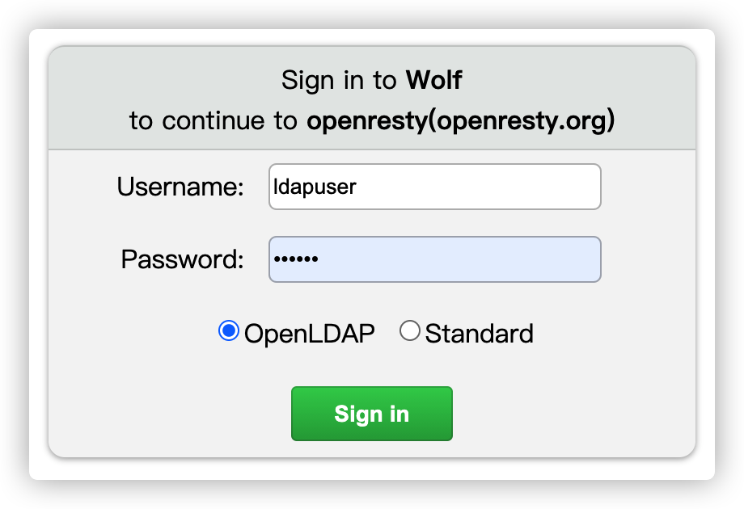

[English](README.md)

## Introductions

Wolf是一个通用的RBAC权限系统，适用于所有的HTTP应用。它提供统一的授权和访问控制功能。

在每个公司内部，通常会有各种不同的后台服务及相应的管理后台。不同的系统往往会有自己独立的账号系统和权限管理模块。这种重复开发导致了开发资源的浪费，而且不统一的账号体系会造成管理上的混乱。如果这些系统是由不同的团队开发的，问题将更加复杂。

Wolf系统可以应用于各种平台和系统之上，实现统一的账号和授权管理。而且无需对各系统进行任何开发修改工作。

## Community

* QQ群: 85892505

## Features

* 语言无关：任何HTTP程序都可以使用，包括但不限于纯静态网页、JSP、PHP、ASP、Python、Node.js等Web系统。
* 低耦合、无侵入性：支持新的应用接入时无需对应用进行任何修改或改造，系统在代理层对资源权限进行管理。
* 自带管理后台（`console模块`）：可以对`应用`、`用户`、`角色`、`权限`和`资源`进行管理。
* 支持OAuth 2.0授权：方便其他应用使用Wolf账号进行登录。
* 支持两种用户认证方式：密码认证和`LDAP`认证。
* 支持`Restful`接口和后端渲染的纯HTML应用。
* 支持访问日志记录与查询，以进行审计和问题追溯。
* 丰富的测试用例，代码行数覆盖率达到90%以上。
* 支持`PostgreSQL`和`MySQL`数据库。
* 支持APISIX网关[apache-apisix:wolf-rbac](https://github.com/apache/apisix/blob/master/docs/zh/latest/plugins/wolf-rbac.md)。
* 系统包含三个主要模块：
  * Wolf-Server：服务实现和管理后台功能实现。
  * Wolf-Console：管理后台前端代码实现。
  * Wolf-Agent：RBAC的Access Check代理。
* 系统包含以下实体对象：
  * 应用（Application）：支持多个应用，不同的应用可以拥有不同的权限、角色和资源。可以查看应用下的RBAC对象关系图表。
  * 用户（User）：整个系统共享用户。可以为用户授权的对象包括：
    * 管理员权限：设置为管理员的用户可以登录`Console`管理后台，并对应用进行管理。
    * 应用列表：可以为用户分配零到多个应用。根据用户类型的不同，应用列表的含义也不同：
      * 对于管理员用户，表示可以对这些应用进行管理。
      * 对于非管理员用户，表示可以登录和使用这些应用。
    * 角色：可以为用户分配多个角色，用户最终拥有的权限是所有角色的权限的合集。
    * 权限：可以直接为用户分配权限。尽管标准的RBAC模型通常不支持这种方式，但本系统支持。
  * 角色（Role）：角色可以包含一组权限。
  * 权限分类（Category）：一种对权限进行分类（分组）的方式，方便管理，通常可以按照大的功能模块进行分类。在系统中的权限选择框中，权限会按照分类进行分组显示。
  * 权限（Permission）：权限与资源是一对多的关系，可以为一个资源分配一个权限，也可以多个资源使用同一个权限。
  * 资源（Resource）：目前主要指HTTP请求。资源的属性包括`匹配类型`+`名称`+`动作`，以确定唯一的资源。一个资源的重要属性有：
    * 匹配类型 (Match Type)：URL的匹配方式，支持`精确匹配`、`后缀匹配`和`前缀匹配`三种模式。
    * 名称 (Name)：指HTTP URL。如果是`精确匹配`和`前缀匹配`，通常以`/`开头。如果是`后缀匹配`，通常是资源共有的后缀，例如`.jpg`、`.js`。*不支持通配符或正则表达式*。
    * 动作 (Action)：指HTTP方法。`ALL`能匹配所有方法。
    * 权限 (Permission)：指访问该资源需要的权限。系统内置了两个权限：`Allow All`表示所有用户都可以访问，`Deny All`表示所有用户都不可访问。
  * 审计日志（Audit Log）：记录了所有经过本系统的访问情况（包括`Wolf-Console`和本系统管理的应用）。主要记录以下信息：
    * 用户ID、用户名、用户昵称；
    * 访问日期、时间和访问者的IP；
    * HTTP方法和URL；
    * 匹配上的资源；
    * 访问响应的状态码；
    * 请求参数或请求正文（仅支持`Wolf-Console`的记录）。
  * 资源匹配方式支持不同的优先级，优先级规则如下：
    * `匹配类型`的优先级从高到低依次为：精确匹配、后缀匹配、前缀匹配。
    * 动作（即HTTP方法）的优先级：ALL优先级较低，其他方法（如GET、POST、PUT）优先级相同，但都高于ALL。
    * 名称（即HTTP URL）的优先级与URL的长度有关，URL越长，优先级越高。

**注意: 本文中的URL仅指URL标准中的path部分, 不包含域名,端口及参数部分**

## Architecture

## Relations

## Technologies

* Server: NodeJS, KOA, Sequelize, JWT
* Console: VueJS, Element, Babel, NodeJS
* Agent: OpenResty(ngx_lua)
* Database: PostgreSQL.
* Cache: Redis

## Getting Started

[快速起步](./quick-start-with-docker/README-CN.md)

##  Preview

#### Console

|  |
|:--:|
| *应用列表* |

|  |
|:--:|
| *应用,用户,角色,权限关系图* |

|  |
|:--:|
| *用户管理* |

|  |
|:--:|
| *角色管理* |

|  |
|:--:|
| *角色的权限详情/权限分组显示* |

|  |
|:--:|
| *权限管理* |

|  |
|:--:|
| *审核日志* |

#### Client/Demo

|  |
|:--:|
| *客户端登陆* |

|  |
|:--:|
| *主页面(注意: 顶部添加了信息栏)* |

|  |
|:--:|
| *无权限页* |

## Deployment

[部署文档](./docs/deploy-cn.md)

[LDAP配置](./docs/ldap-config-cn.md)

[API文档](./docs/admin-api-cn.md)

[OAuth2接口文档](./docs/admin-api-oauth2.0-cn.md)

## Tests

[`Server`接口单元测试](./docs/unittest-cn.md)

## Performance

[`Agent`接口性能测试](./docs/perf-cn.md)

## Manual Document

[使用指南](./docs/usage.md)

## Change Log

[Change Log](./ChangeLog.md)

## License

[MIT](./LICENSE)

