[Chinese](README-CN.md)

## Introductions

wolf is a universal RBAC system, suitable for all HTTP applications. Unified authorization and access control.

Within each company, there are different backend services and corresponding management backend. Usually different systems have their own account system and permission management module. Repeated development makes development resources wasteful. And there is no unified account number, causing administrative confusion. This would be even worse if the system was developed by a different team.

The system can be applied to a variety of platforms and systems. Unified account number and unified authorization. And no development work is required for each system.

## Features

* Language independent, any HTTP program can be used, including but not limited to: pure static web pages, JSP, PHP, ASP, PYTHON, NODE JS and other WEB systems
* Low coupling, non-intrusive, supports new applications without any modifications or changes to the application, the system manages resource rights at the proxy level
* Management backend (`console module`) for `application`, `user`, `role`, `permission` and `resources` management
* The `OAuth 2.0` authorization is supported and other applications can easily use `wolf` as an authentication source.
* Supports `Restful` interface, also supports `pure html` applications for backend rendering
* Support access logging and querying for auditing
* APISIX gateway support[apache-apisix:wolf-rbac](https://github.com/apache/incubator-apisix/blob/master/doc/plugins/wolf-rbac-cn.md)
* The system has three main modules:
  * Wolf-Server, Service implementation, management backend functionality implementation
  * Wolf-Console, Management-backend's frontend code implementation
  * Wolf-Agent, RBAC's access check agent
* The system contains the following entity objects:
  * `Application`, Multi-application support. Different applications can have different permissions, roles and resources. You can view the RBAC object relationship diagram under the application.
  * `User`, Users are Shared by all applications. Objects that can be authorized for users include:
    * Administrator privileges, users set as administrators can log in to "Console" to manage the backend and manage the application.
    * Application list, which can assign zero to multiple applications to a user. Depending on the type of user, the meaning of the application list varies:
      * For administrative users, these applications can be managed.
      * For non-administrative users, these applications can be accessed and used
    * Roles, you can assign multiple roles to the user, and the permissions you end up with are a collection of permissions for all roles
    * Permission, the system can assign permissions directly to users. Although this approach is not usually supported in standard RBAC models, this system supports
  * `Role`, role can contain a set of permissions.
  * `Category`, permissions category, is a way to classify (group) permissions for easy management, usually by large functional modules. In the system Permissions selection box, the permissions will be grouped by category.
  * `Permission`, permissions and resources are a one-to-many relationship, one resource can have one permission, or multiple resources can use the same permission.
  * `Resource`, Currently it is mainly HTTP requests. The properties `Match Type` + `Name` + `Action` of a resource determine a unique resource. The most important 4 tuple groups for a resource are:
    * `Match Type`, URL match type, supports `equals match`, `suffix match`,`prefix match` three types.
    * `Name`, Refers to the requested HTTP URL. If it is an `equals match` and `prefix match`, it usually starts with `/`. If it is a `suffix match`, it is usually a common resource suffix, such as: `.jpg', `.js', *no wildcards or regulars* are supported.
    * `Action`, refers to the requested `HTTP Method`.  The method `ALL` matches all methods.
    * `Permission`, Specify the permissions required to access the resource. Two built-in permissions: `Allow All` means that all users have access, and `Deny All` means that all users cannot access.
  * `Audit Log`, An audit log, which records all accesses to the system (including `Wolf-Console` and applications managed by the system). The following key information was recorded:
    * User ID, User Name, User Nickname
    * Access date, time and IP of the visitor
    * HTTP method, and URL
    * Match on resources.
    * The status code of the access response.
    * Request args parameter or request body (only `Wolf-Console` records are supported).
* The resource matching method, which supports different priorities, has the following priority rules:
  * `Match Type` priority from high to low, in order:equals match, suffix match, prefix match.
  * `Action` means` HTTP Method`. `ALL` has lower priority. Other methods (such as` GET`, `POST`,` PUT`) have the same priority, but all have higher priority than `ALL`.
  * `Name` means `HTTP URL`. The priority is related to the URL length. The longer the URL, the higher the priority.

**Note: The URL in this article refers only to the path section of the URL standard, not the domain name, port and parameters section.**

## Architecture

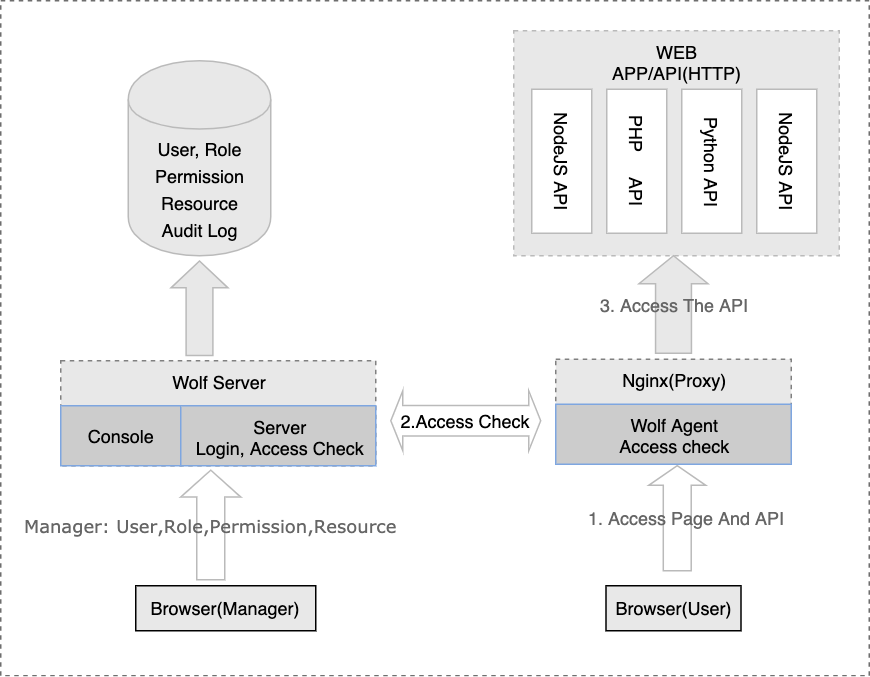

## Relations

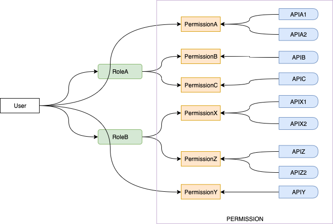

## Technologies

* Server: NodeJS, KOA, Sequelize, JWT
* Console: VueJS, Element, Babel, NodeJS
* Agent: OpenResty(ngx_lua)
* Database: PostgreSQL.

## Getting Started

[Getting Started](./quick-start-with-docker/README.md)

##  Preview

#### Console

| 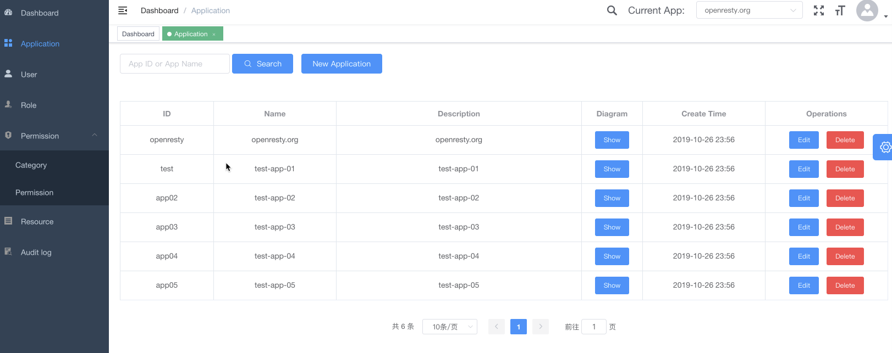 |
|:--:|
| *Application List* |

| 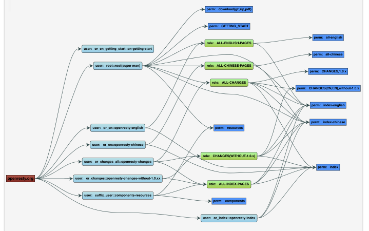 |
|:--:|
| *Application, User, Role, Permission Relations* |

| 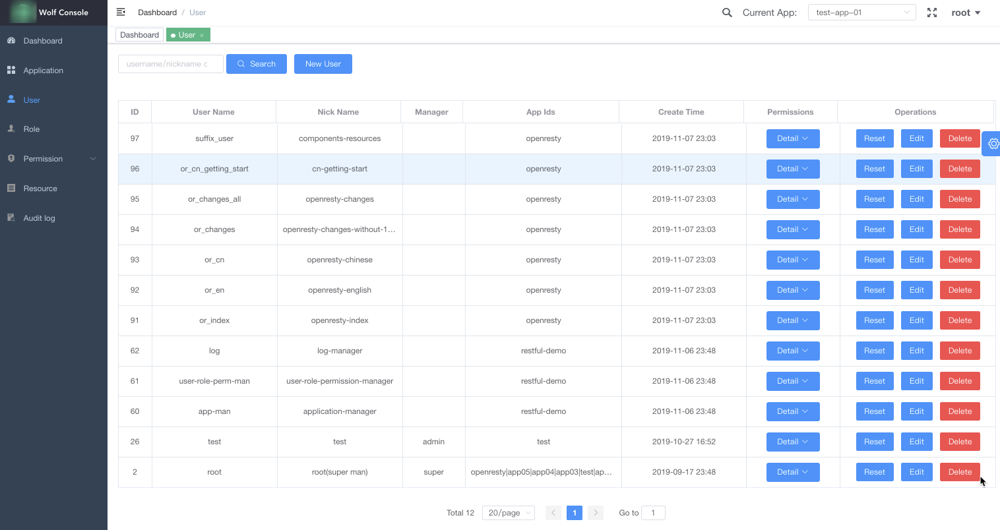 |
|:--:|
| *user management* |

| 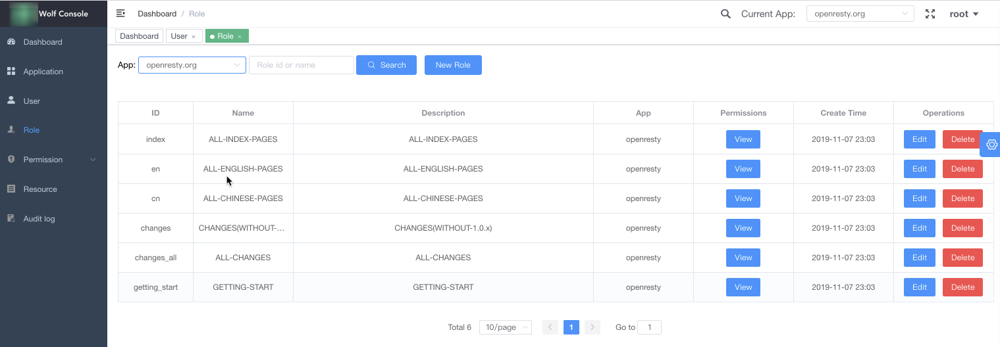 |
|:--:|
| *role management* |

| 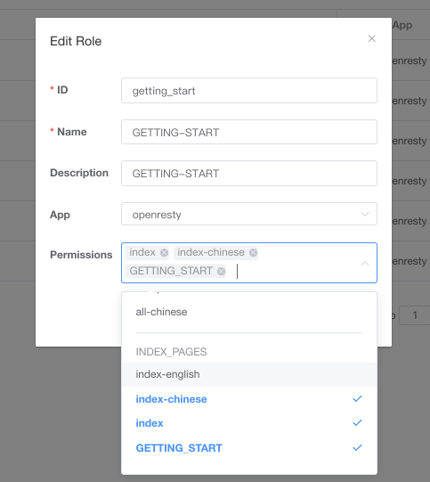 |
|:--:|
| *Details of the role's permissions/Permissions grouping display* |

| 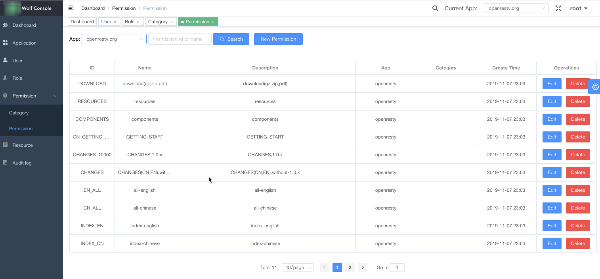 |
|:--:|
| *permission management* |

| 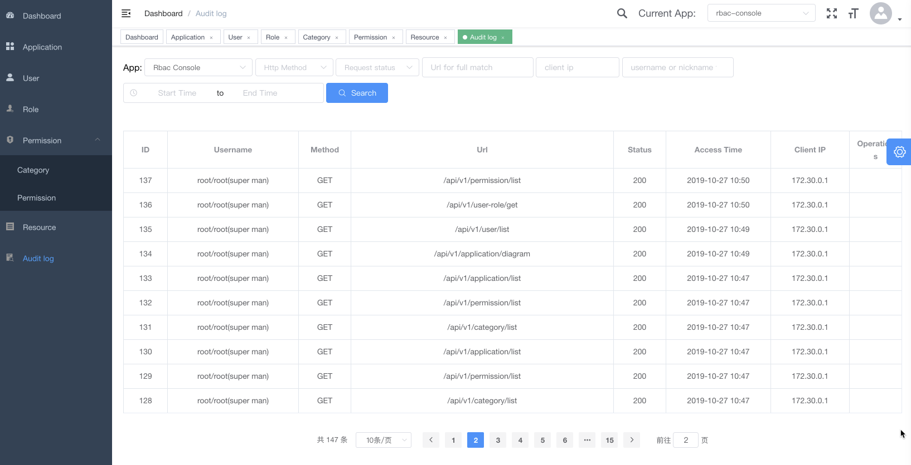 |
|:--:|
| *Audit log* |

#### Client/Demo

|  |
|:--:|
| *client login* |

| 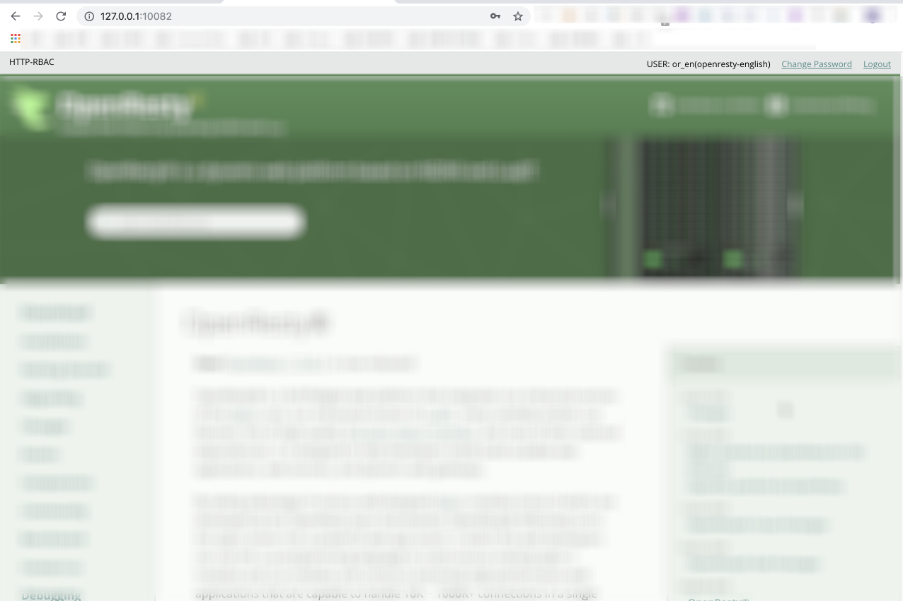 |
|:--:|
| *main page(Note: Added information bar at top.)* |

| 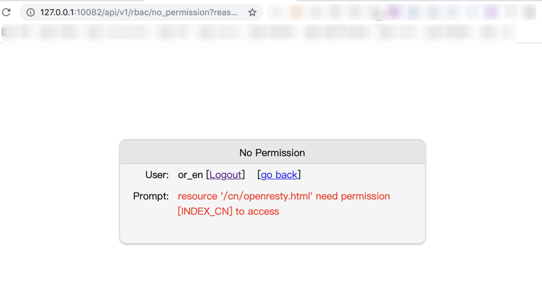 |
|:--:|
| *No permission page* |

## Deployment

[deployment document](./docs/deploy.md)

[API documentation](./docs/admin-api.md)

[OAuth2 interface documentation](./docs/admin-api-oauth2.0.md)

## Manual Document

[Usage](./docs/usage.md)

## Change Log

[Change Log](./ChangeLog.md)

## License

[MIT](./LICENSE)

