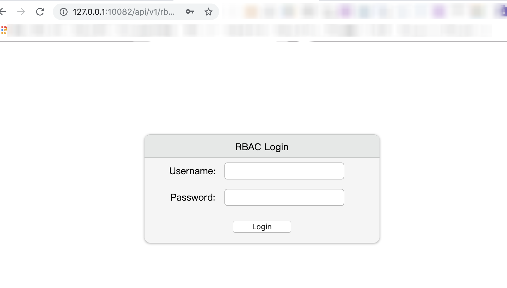

[中文](admin-api-cn.md)

# Contents

- [Contents](#Contents)
  - [Protocol](#Protocol)
  - [Models](#Models)
  - [Console Login](#Login)
  - [Application](#API-Application)
  - [User](#API-User)
  - [Role](#API-role)
  - [Permission](#API-Permission)
  - [User-Role](#API-User-Role)
  - [Category](#API-Category)
  - [Resource](#API-Resource)
  - [AccessLog](#API-AccessLog)
  - [RBAC API For Wolf-Agent](#API-RBAC)
  - [OAuth2](./admin-api-oauth2.0.md)


## Protocol

* The Wolf interface uses `Restful` + `JSON` to communicate.
* `POST`, `PUT`, `DELETE` requests all use `Request Body` to pass parameters, all in JSON format.
* `Content-Type` for both request and response is `application/json`.
* The body of the response contains a unified structure, which is later documented and no longer lists the entire structure, only the `reason` and `data` parts.

### Example of a common structure of a response body:

```
{"ok": true, "reason": "error code or message", "errmsg": "error message", data: {When successful, the data returned}}
```

### Generic field description of response

Field | Type | Required | Description
-------|-------|------|-----
ok | boolean | Yes | Service Status
reason | string | No | When `ok=false`, `reason` is the error code.
errmsg | string | No | When `ok=false`, `errmsg` is the error message prompt.
data | object | No | When `ok=true`, `data` is the returned information.

### The system contains the following generic error codes(reason):

  * `ERR_ARGS_ERROR` Request parameter error, response code is `400`
  * `ERR_TOKEN_INVALID` TOKEN invalid or missing, response code is `401`
  * `ERR_ACCESS_DENIED` No authority to perform operations, response code `401`
  * `ERR_DUPLICATE_KEY_ERROR` duplicated when updating data, response code `400`
  * `ERR_SERVER_ERROR` Server internal error, response code `500`


## Models

### UserModels

#### UserInfo

Field | Type | Required | Description
-------|-------|------|-----
id | integer |Yes| User ID
username | string |Yes| User name
nickname | string | Yes | User nickname
email | string | No | User email
appIDs | string[] | No | List of appIDs associated with users
manager | string | Yes | admin role, super: super admin, admin: general admin
createTime | integer | Yes | create time

#### SimpleUserInfo

Field | Type | Required | Description
-------|-------|------|-----
id | integer | Yes | User ID
username | string | Yes | User name
nickname | string | Yes | User nickname


### ApplicationModels

#### SimpleApplication

Field | Type | Required | Description
-------|-------|------|-----
id | string | Yes | Application ID
name | string | Yes | Application name
description | string | No | Description
createTime | integer | Yes | Create time

#### Application

Field | Type | Required | Description
-------|-------|------|-----
id | string | Yes | Application ID
name | string | Yes | Application name
description | string | No | Description
secret | string | No | Secret of application, used for OAuth2 login
redirectUris | string[] | No | redirect urls after successful OAuth2 login
accessTokenLifetime | integer | No | OAuth2's AccessToken life time, in seconds.
refreshTokenLifetime | integer | No | OAuth2's RefreshToken life time, in seconds.
createTime | integer | Yes | Create time
updateTime | integer | Yes | Update time


### RoleModels

#### Role

Field | Type | Required | Description
-------|-------|------|-----
id | string | Yes | Role ID
appID | string | Yes | Application ID
name | string | Yes | Role name
description | string | No | Role description
permIDs | string[] | No | List of permissions held by the role
createTime | integer | Yes | Create time


### PermissionModels

#### Permission

Field | Type | Required | Description
-------|-------|------|-----
id | string | Yes | Permission ID
appID | string | Yes | Application ID
name | string | Yes | Permission name
description | string | No | Permission description
categoryID | integer | No | Category ID of the permission
createTime | integer | Yes | Create time


### CategoryModels

#### Category

Field | Type | Required | Description
-------|-------|------|-----
id | string | Yes | Category ID
appID | string | Yes | Application ID
name | string | Yes | Category name
createTime | integer | Yes | Create name

### ResourceModels

#### Resource

Field | Type | Required | Description
-------|-------|------|-----
id | string | Yes | Resource ID
appID | string | Yes | Application ID
matchType | string | Yes | Resource match type, equal: equal match, suffix: suffix match, prefix: prefix match.
name | string | Yes | Resource name, when matchType is equal, name is URL, when matchType is suffix, name is suffix value, when matchType is prefix, name is prefix of URL.
action | string | Yes | The action/operation of the resource, usually the HTTP request method. The following values are available: ALL, GET, POST, PUT, DELETE, HEAD, OPTIONS, PATCH. where ALL indicates that all HTTP methods can be matched.
priority | integer | Yes | Resource priorities.
permID | string | Yes | permission required to access the resource
createTime | integer | Yes | Create time

### AccessLogModels

#### AccessLog

Field | Type | Required | Description
-------|-------|------|-----
id | integer | Yes | Log ID
appID | string | Yes | Application ID
userID | string | Yes | Operating user ID
username | string | Yes | Operating user name
nickname | string | Yes | Operating user nickname
action | string | Yes | Operations performed (HTTP request method)
resName | string | Yes | URL to access
status | integer | Yes | response status code
date | string | Yes | Date of access, formatted as yyyy-mm-dd
accessTime | integer | Yes | Access time, unix timestamp
ip | string | Yes | IP of the visitor


## Login

The `Console` login interface is available only to users with administrator roles of `super` and `admin`.

Most interfaces in the administration backend require a Token, which is obtained after login with the administrator account. For interfaces that require a token, the token can be passed through the request header `x-rbac-token`.

The default token expiration time is 30 days. This can be changed via the environment variable `CONSOLE_TOKEN_EXPIRE_TIME`, in seconds. After modification, you need to restart `Wolf-Server`.

#### Method: POST
#### URL: /wolf/user/login
#### `Request Body` parameters

Field | Type | Required | Description
-------|-------|------|-----
username | string | Yes | User name
password | string | Yes | Password

#### Response Body

* data:

Field | Type | Required | Description
-------|-------|------|-----
token | string | Yes | User login token
userInfo | [UserInfo](#UserInfo) | Yes | Login User Information
applications | [SimpleApplication](#SimpleApplication)[] | Yes | User's application list.

* reason:
  * ERR_USER_NOT_FOUND: User do not exist
  * ERR_PASSWORD_ERROR: Password error
  * ERR_USER_DISABLED User are disabled.
  * ERR_ACCESS_DENIED Non-administrative users cannot log in.

#### example

* Request

```json
curl http://127.0.0.1:10080/wolf/user/login \
-H "Content-Type: application/json" \
-d '{ "username": "root", "password": "password"}'
```

* Response

```json
{
  "ok": true,
  "reason": "",
  "data": {
    "token": "WOLF-TOKEN-ENCODE-BY-JWT",
    "userInfo": {
      "id": 1,
      "username": "root",
      "nickname": "root(super man)",
      "email": null,
      "appIDs": [
        "openresty"
      ],
      "manager": "super",
      "createTime": 1580486400
    },
    "applications": [
      {
        "id": "restful",
        "name": "restful app",
        "description": "restful",
        "createTime": 1580486400
      }
    ]
  }
}
```

To facilitate the execution of the later example, save the `token` above as a variable in the shell environment:
```shell
export WOLF_TOKEN="WOLF-TOKEN-ENCODE-BY-JWT"
```


## API-Application

### Add Application

Add a new application

#### Method: POST
#### URL: /wolf/application
#### `Header` parameters: Requires a token of [`Console` login](#Login), passed through the `x-rbac-token` request header.
#### `Request Body` parameters

Field | Type | Required | Description
-------|-------|------|-----
id | string | Yes | Application ID, must be unique
name | string | Yes | Application name, must be unique
description | string | No | Application description
secret | string | No | Secret of application, used for OAuth2 login
redirectUris | string[] | No | redirect urls after successful OAuth2 login
accessTokenLifetime | integer | No | OAuth2's AccessToken life time in seconds, if it is 0, use the system default: 7 days.
refreshTokenLifetime | integer | No | OAuth2's RefreshToken life time, in seconds, if it is 0, use the system default: 30 days.


#### Response Body

* data:

Field | Type | Required | Description
-------|-------|------|-----
application | [Application](#Application) | Yes | Newly added application information

#### example

* Request

```json
curl http://127.0.0.1:10080/wolf/application \
-H "Content-Type: application/json" \
-H "x-rbac-token: $WOLF_TOKEN" \
-d '{
    "id": "test-app", "name": "application for test", "description": "description of application",
    "secret": "d41d8cd98f00b204e9800998ecf8427e",
    "redirectUris": ["http://127.0.0.1:10080/callback"],
    "accessTokenLifetime": 604801,
    "refreshTokenLifetime": 2592001
}'
```

* Response

```json
{
  "ok": true,
  "reason": "",
  "data": {
    "application": {
      "id": "test-app",
      "name": "application for test",
      "description": "description of application",
      "redirectUris": [
        "http://127.0.0.1:10080/callback"
      ],
      "grants": null,
      "accessTokenLifetime": 604801,
      "refreshTokenLifetime": 2592001,
      "createTime": 1580486400,
      "updateTime": 1580486400
    }
  }
}
```

### Modify application

Modify application information

#### Method: PUT
#### URL: /wolf/application
#### `Header` parameters: Requires a token of [`Console` login](#Login), passed through the `x-rbac-token` request header.
#### `Request Body` parameters

Field | Type | Required | Description
-------|-------|------|-----
id | string | Yes | Application ID, must be unique, application ID cannot be modified.
name | string | Yes | Application name, must be unique
description | string | No | Application description
secret | string | No | Secret of application, used for OAuth2 login
redirectUris | string[] | No | redirect urls after successful OAuth2 login
accessTokenLifetime | integer | No | OAuth2's AccessToken life time in seconds, if it is 0, use the system default: 7 days.
refreshTokenLifetime | integer | No | OAuth2's RefreshToken life time, in seconds, if it is 0, use the system default: 30 days.

#### Response Body

* data:

Field | Type | Required | Description
-------|-------|------|-----
application | [Application](#Application) | Yes | Modified application information

#### example

* Request

```json
curl http://127.0.0.1:10080/wolf/application \
-H "Content-Type: application/json" \
-H "x-rbac-token: $WOLF_TOKEN" \
-X PUT \
-d '{
    "id": "test-app", "name": "test-application", "description": "description of application",
    "secret": "d41d8cd98f00b204e9800998ecf8427e",
    "redirectUris": ["http://127.0.0.1:10080/callback2"],
    "accessTokenLifetime": 604802,
    "refreshTokenLifetime": 2592002
}'
```

* Response

```json
{
  "ok": true,
  "reason": "",
  "data": {
    "application": {
      "id": "test-app",
      "name": "test-application",
      "description": "description of application",
      "redirectUris": [
        "http://127.0.0.1:10080/callback2"
      ],
      "grants": null,
      "accessTokenLifetime": 604802,
      "refreshTokenLifetime": 2592002,
      "createTime": 1580486400,
      "updateTime": 1580486401
    }
  }
}
```

### Query a single application

Query a single application infomation

#### Method: GET
#### URL: /wolf/application/get
#### `Header` parameters: Requires a token of [`Console` login](#Login), passed through the `x-rbac-token` request header.
#### `Query` parameters

Field | Type | Required | Description
-------|-------|------|-----
id | string | Yes | Application ID to query

#### Response Body

* data:

Field | Type | Required | Description
-------|-------|------|-----
application | [Application](#Application) | Yes | Application information queried

* reason:
  * `ERR_OBJECT_NOT_FOUND` The application ID of the query does not exist.

#### example

* Request

```json
curl "http://127.0.0.1:10080/wolf/application/get?id=test-app" \
-H "x-rbac-token: $WOLF_TOKEN"
```

* Response

```json
{
  "ok": true,
  "reason": "",
  "data": {
    "application": {
      "id": "test-app",
      "name": "test-application",
      "description": "description of application",
      "redirectUris": [
        "http://127.0.0.1:10080/callback2"
      ],
      "grants": null,
      "accessTokenLifetime": 604802,
      "refreshTokenLifetime": 2592002,
      "createTime": 1580486400,
      "updateTime": 1580486401
    }
  }
}
```

### Query the application Secret

Query the Secret of an application.

#### Method: GET
#### URL: /wolf/application/secret
#### `Header` parameters: Requires a token of [`Console` login](#Login), passed through the `x-rbac-token` request header.
#### `Query` parameters

Field | Type | Required | Description
-------|-------|------|-----
id | string | Yes | Application ID to query

#### Response Body

* data:

Field | Type | Required | Description
-------|-------|------|-----
secret | string | Yes | Secret of application

* reason:
  * `ERR_OBJECT_NOT_FOUND` The application ID of the query does not exist.

#### example

* Request

```json
curl "http://127.0.0.1:10080/wolf/application/secret?id=test-app" \
-H "x-rbac-token: $WOLF_TOKEN"
```

* Response

```json
{
  "ok": true,
  "reason": "",
  "data": {
    "secret": "d41d8cd98f00b204e9800998ecf8427e"
  }
}
```

### Application List Query

Query the application list information.

#### Method: GET
#### URL: /wolf/application/list
#### `Header` parameters: Requires a token of [`Console` login](#Login), passed through the `x-rbac-token` request header.
#### `Query` parameters

Field | Type | Required | Description
-------|-------|------|-----
key | string | No | Matching by ID or name
sort | string | No | Sort field, e.g.: -id: means sort by id descending order. +name: Indicates ascending order by name.
page | integer | No | Page number, incremental from 1, default is 1
limit | integer | No | Page size, default is 10

#### Response Body

* data:

Field | Type | Required | Description
-------|-------|------|-----
applications | [Application](#Application)[] | Yes | application list.
total | integer | Yes | Total number of records

#### example

* Request

```json
curl http://127.0.0.1:10080/wolf/application/list \
-H "x-rbac-token: $WOLF_TOKEN"
```

* Response

```json
{
  "ok": true,
  "reason": "",
  "data": {
    "applications": [
     {
        "id": "restful",
        "name": "restful app",
        "description": "restful",
        "redirectUris": [
          "http://localhost:10080/wolf/oauth2/client_app"
        ],
        "grants": null,
        "accessTokenLifetime": 3600,
        "refreshTokenLifetime": 2592000,
        "createTime": 1578817535,
        "updateTime": 1587375156
      },
      ...
    ],
    "total": 6
  }
}
```


### List of all applications

Search all applications, no pagination.

#### Method: GET
#### URL: /wolf/application/list_all
#### `Header` parameters: Requires a token of [`Console` login](#Login), passed through the `x-rbac-token` request header.
#### `Query` parameters

None

#### Response Body

* data:

Field | Type | Required | Description
-------|-------|------|-----
applications | [Application](#Application)[] | Yes | all application list.
total | integer | Yes | Total number of records

#### example

* Request

```json
curl http://127.0.0.1:10080/wolf/application/list_all \
-H "x-rbac-token: $WOLF_TOKEN"
```

* Response

```json
{
  "ok": true,
  "reason": "",
  "data": {
    "applications": [
     {
        "id": "restful",
        "name": "restful app",
        "description": "restful",
        "redirectUris": [
          "http://localhost:10080/wolf/oauth2/client_app"
        ],
        "grants": null,
        "accessTokenLifetime": 3600,
        "refreshTokenLifetime": 2592000,
        "createTime": 1578817535,
        "updateTime": 1587375156
      },
      ...
    ],
    "total": 6
  }
}
```

### Delete application

Delete an application

#### Method: DELETE
#### URL: /wolf/application
#### `Header` parameters: Requires a token of [`Console` login](#Login), passed through the `x-rbac-token` request header.
#### `Request Body` parameters

Field | Type | Required | Description
-------|-------|------|-----
id | string | Yes | Application ID to be deleted

#### Response Body

* data:

Field | Type | Required | Description
-------|-------|------|-----
count | integer | Yes | Number of deletions, usually 1.

* reason:
  * `ERR_OBJECT_NOT_FOUND` The application to be deleted does not exist.

#### example

* Request

```json
curl http://127.0.0.1:10080/wolf/application \
-H "Content-Type: application/json" \
-H "x-rbac-token: $WOLF_TOKEN" \
-X DELETE \
-d '{
    "id": "test-app"
}'
```

* Response

```json
{
  "ok": true,
  "reason": "",
  "data": {
    "count": 1
  }
}
```


## API-User

### Add User

Add a new user

#### Method: POST
#### URL: /wolf/user
#### `Header` parameters: Requires a token of [`Console` login](#Login), passed through the `x-rbac-token` request header.
#### `Request Body` parameters

Field | Type | Required | Description
-------|-------|------|-----
username | string | Yes | User name, to be used when loginto the system, must be composed of `letter + number + underscore' and must be unique.
nickname | string | Yes | User nickname
password | string | No | The user password, if empty, will be generated by the service with a random value.
email | string | No | User's email.(not used)
tel | string | No | The user's mobile phone number.
appIDs | string[] | No | A list of privileged appIDs managed by the user.
manager | string | No | Administrative permission, super: super administrator, with all permissions, admin: with basic administrative permissions (cannot add, modify, delete interfaces to applications and users).
status | integer | No | User status, 0: normal status, -1: disabled status.

#### Response Body

* data:

Field | Type | Required | Description
-------|-------|------|-----
userInfo | [UserInfo](#UserInfo) | Yes | Newly added user information
password | string | Yes | Password for newly added users

#### example

* Request

```json
curl http://127.0.0.1:10080/wolf/user \
-H "Content-Type: application/json" \
-H "x-rbac-token: $WOLF_TOKEN" \
-d '{
    "username": "test-user",
    "nickname": "user for test",
    "password": "abc#123",
    "email": "test-user@test.com",
    "tel": "123456",
    "appIDs": ["restful"],
    "manager": "none",
    "status": 0
}'
```

* Response

```json
{
  "ok": true,
  "reason": "",
  "data": {
    "password": "abc#123",
    "userInfo": {
      "id": 1024,
      "username": "test-user",
      "nickname": "user for test",
      "email": "test-user@test.com",
      "appIDs": [
        "restful"
      ],
      "manager": "none",
      "createTime": 1588576578
    }
  }
```

### Modify user

Modify user information

#### Method: PUT
#### URL: /wolf/user
#### `Header` parameters: Requires a token of [`Console` login](#Login), passed through the `x-rbac-token` request header.
#### `Request Body` parameters

Field | Type | Required | Description
-------|-------|------|-----
id | integer | Yes | User ID, User ID to be modified
username | string | Yes | User name, to be used when loginto the system, must be composed of `letter + number + underscore' and must be unique.
nickname | string | Yes | User nickname
email | string | No | User's email.(not used)
tel | string | No | The user's mobile phone number.
appIDs | string[] | No | A list of privileged appIDs managed by the user.
manager | string | No | Administrative permission, super: super administrator, with all permissions, admin: with basic administrative permissions (cannot add, modify, delete interfaces to applications and users).
status | integer | No | User status, 0: normal status, -1: disabled status.


#### Response Body

* data:

Field | Type | Required | Description
-------|-------|------|-----
userInfo | [UserInfo](#UserInfo) | Yes | Modified user information

* reason:
  * `ERR_USER_NOT_FOUND` The user ID to be modified does not exist.

#### example

* Request

```json
curl http://127.0.0.1:10080/wolf/user \
-H "Content-Type: application/json" \
-H "x-rbac-token: $WOLF_TOKEN" \
-X PUT \
-d '{
    "id": 1024,
    "username": "test-user",
    "nickname": "nickname for test",
    "email": "test-user@test.com",
    "tel": "123456",
    "appIDs": ["restful"],
    "manager": "none",
    "status": 0
}'
```

* Response

```json
{
  "ok": true,
  "reason": "",
  "data": {
    "effects": 1,
    "userInfo": {
      "id": 1024,
      "username": "test-user",
      "nickname": "nickname for test",
      "email": "test-user@test.com",
      "appIDs": [
        "restful"
      ],
      "manager": "none",
      "createTime": 1588576578
    }
  }
}
```

### Check current user information

Query the user information of the specified token.

#### Method: GET
#### URL: /wolf/user/info
#### `Header` parameters: Requires a token of [`Console` login](#Login), passed through the `x-rbac-token` request header.
#### `Query` parameters

None

#### Response Body

* data:

Field | Type | Required | Description
-------|-------|------|-----
userInfo | [UserInfo](#UserInfo) | Yes | Modified user information
applications | [SimpleApplication](#SimpleApplication)[] | No | User Associated Applications List.

#### example

* Request

```json
curl "http://127.0.0.1:10080/wolf/user/info" \
-H "x-rbac-token: $WOLF_TOKEN"
```

* Response

```json

  "ok": true,
  "reason": "",
  "data": {
    "userInfo": {
      "id": 696,
      "username": "root",
      "nickname": "root(super man)",
      "email": null,
      "appIDs": [
        "openresty"
      ],
      "manager": "super",
      "createTime": 1578401859
    },
    "applications": [
      {
        "id": "restful",
        "name": "restful app",
        "description": "restful",
        "createTime": 1578817535
      },
      ...
    ]
  }
}
```

### User list query

Query the user list information

#### Method: GET
#### URL: /wolf/user/list
#### `Header` parameters: Requires a token of [`Console` login](#Login), passed through the `x-rbac-token` request header.
#### `Query` parameters

Field | Type | Required | Description
-------|-------|------|-----
key | string | No | Search for username,nickname,tel field.
sort | string | No | Sort field, e.g.: -id: means sort by id descending order. +name: Indicates ascending order by name.
page | integer | No | Page number, incremental from 1, default is 1
limit | integer | No | Page size, default is 10

#### Response Body

* data:

Field | Type | Required | Description
-------|-------|------|-----
userInfos | [UserInfo](#UserInfo)[] | Yes | user list
total | integer | Yes | Total number of records

#### example

* Request

```json
curl http://127.0.0.1:10080/wolf/user/list \
-H "x-rbac-token: $WOLF_TOKEN"
```

* Response

```json
{
  "ok": true,
  "reason": "",
  "data": {
    "userInfos": [
     {
        "id": 697,
        "username": "admin",
        "nickname": "administrator",
        "email": null,
        "appIDs": [
          "openresty",
          "restful"
        ],
        "manager": "admin",
        "createTime": 1578401859
      },
      ...
    ],
    "total": 6
  }
}
```


### Reset user password

Reset the user's password

#### Method: PUT
#### URL: /wolf/user/reset_pwd
#### `Header` parameters: Requires a token of [`Console` login](#Login), passed through the `x-rbac-token` request header.
#### `Request Body` parameters

Field | Type | Required | Description
-------|-------|------|-----
id | integer | Yes | User ID to reset password

#### Response Body

* data:

Field | Type | Required | Description
-------|-------|------|-----
password | string | Yes | Password to reset.

* reason:
  * `ERR_USER_NOT_FOUND` The user to be deleted does not exist.
  * `ERR_ACCESS_DENIED` Only a super administrator can do this.

#### example

* Request

```json
curl http://127.0.0.1:10080/wolf/user/reset_pwd \
-H "Content-Type: application/json" \
-H "x-rbac-token: $WOLF_TOKEN" \
-X PUT \
-d '{
    "id": 696
}'
```

* Response

```json
{
  "ok": true,
  "reason": "",
  "data": {
    "password": "197TLR0dPVdm"
  }
}
```


### Delete user

Delete an user

#### Method: DELETE
#### URL: /wolf/user
#### `Header` parameters: Requires a token of [`Console` login](#Login), passed through the `x-rbac-token` request header.
#### `Request Body` parameters

Field | Type | Required | Description
-------|-------|------|-----
id | integer | Yes | User ID to be deleted

#### Response Body

* data:

Field | Type | Required | Description
-------|-------|------|-----
userInfo | [UserInfo](#UserInfo) | Yes | Deleted user information
count | integer | Yes | Number of deletions, usually 1.

* reason:
  * `ERR_USER_NOT_FOUND` The user to be deleted does not exist.
  * `ERR_PERMISSION_DENY` Can't delete super account
  * `ERR_ACCESS_DENIED` Only a super administrator can do this.

#### example

* Request

```json
curl http://127.0.0.1:10080/wolf/user \
-H "Content-Type: application/json" \
-H "x-rbac-token: $WOLF_TOKEN" \
-X DELETE \
-d '{
    "id": 2756
}'
```

* Response

```json
{
  "ok": true,
  "reason": "",
  "data": {
    "count": 1
  }
}
```

## API-Role

### Add Role

Add a new role

#### Method: POST
#### URL: /wolf/role
#### `Header` parameters: Requires a token of [`Console` login](#Login), passed through the `x-rbac-token` request header.
#### `Request Body` parameters

Field | Type | Required | Description
-------|-------|------|-----
appID | string | Yes | Application ID, the role can only belong to a certain application.
id | string | Yes | Role ID, must be unique within the application
name | string | Yes | Role name, must be unique within the application
description | string | No | Role description
permIDs | string[] | No | A list of permission IDs for the role.

#### Response Body

* data:

Field | Type | Required | Description
-------|-------|------|-----
role | [Role](#Role) | Yes | Newly added role information

#### example

* Request

```json
curl http://127.0.0.1:10080/wolf/role \
-H "Content-Type: application/json" \
-H "x-rbac-token: $WOLF_TOKEN" \
-d '{
    "id": "test-role",
    "appID": "restful",
    "name": "role for test",
    "description": "description of role",
    "permIDs": ["PERM_XXX"]
}'
```

* Response

```json
{
  "ok": true,
  "reason": "",
  "data": {
    "role": {
      "id": "test-role",
      "appID": "restful",
      "name": "role for test",
      "description": "description of role",
      "permIDs": [
        "PERM_XXX"
      ],
      "createTime": 1588583707
    }
  }
}
```

### Modify Role

Modify a role

#### Method: PUT
#### URL: /wolf/role
#### `Header` parameters: Requires a token of [`Console` login](#Login), passed through the `x-rbac-token` request header.
#### `Request Body` parameters

Field | Type | Required | Description
-------|-------|------|-----
appID | string | Yes | Application ID, cannot be modified
id | string | Yes | Role ID, cannot be modified
name | string | Yes | Role name, must be unique within the application
description | string | No | Role Description.
permIDs | string[] | No | A list of permission IDs for the role.

#### Response Body

* data:

Field | Type | Required | Description
-------|-------|------|-----
role | [Role](#Role) | Yes | Modified role information

#### example

* Request

```json
curl http://127.0.0.1:10080/wolf/role \
-H "Content-Type: application/json" \
-H "x-rbac-token: $WOLF_TOKEN" \
-X PUT \
-d '{
    "id": "test-role",
    "appID": "restful",
    "name": "role for test",
    "description": "description of role",
    "permIDs": ["PERM_YYY"]
}'
```

* Response

```json
{
  "ok": true,
  "reason": "",
  "data": {
    "role": {
      "id": "test-role",
      "appID": "restful",
      "name": "role for test",
      "description": "description of role",
      "permIDs": [
        "PERM_YYY"
      ],
      "createTime": 1588583707
    }
  }
}
```


### Role list query

Query Role List Information

#### Method: GET
#### URL: /wolf/role/list
#### `Header` parameters: Requires a token of [`Console` login](#Login), passed through the `x-rbac-token` request header.
#### `Query` parameters

Field | Type | Required | Description
-------|-------|------|-----
appID | string | Yes | Application ID
key | string | No | Matching queries by ID or name
sort | string | No | Sort field, e.g.: -id: means sort by id descending order. +name: Indicates ascending order by name.
page | integer | No | Page number, incremental from 1, default is 1
limit | integer | No | Page size, default is 10

#### Response Body

* data:

Field | Type | Required | Description
-------|-------|------|-----
roles | [Role](#Role)[] | Yes | Role list
total | integer | Yes | Total number of records

#### example

* Request

```json
curl http://127.0.0.1:10080/wolf/role/list?appID=restful \
-H "x-rbac-token: $WOLF_TOKEN"
```

* Response

```json
{
  "ok": true,
  "reason": "",
  "data": {
    "roles": [
      {
        "id": "test-role",
        "name": "role for test",
        "description": "description of role",
        "appID": "restful",
        "permIDs": [
          "PERM_YYY"
        ],
        "createTime": 1588583707,
        "updateTime": 1588586200
      },
      ...
    ],
    "total": 5
  }
}
```


### Delete Role

Delete a role

#### Method: DELETE
#### URL: /wolf/role
#### `Header` parameters: Requires a token of [`Console` login](#Login), passed through the `x-rbac-token` request header.
#### `Request Body` parameters

Field | Type | Required | Description
-------|-------|------|-----
appID | string | Yes | Application ID
id | string | Yes | Role ID to be deleted

#### Response Body

* data:

Field | Type | Required | Description
-------|-------|------|-----
count | integer | Yes | Number of deletions, usually 1.

#### example

* Request

```json
curl http://127.0.0.1:10080/wolf/role \
-H "Content-Type: application/json" \
-H "x-rbac-token: $WOLF_TOKEN" \
-X DELETE \
-d '{
    "id": "test-role",
    "appID": "restful"
}'
```

* Response

```json
{
  "ok": true,
  "reason": "",
  "data": {
    "count": 1
  }
}
```


## API-Permission

### Add Permission

Add a new permission

#### Method: POST
#### URL: /wolf/permission
#### `Header` parameters: Requires a token of [`Console` login](#Login), passed through the `x-rbac-token` request header.
#### `Request Body` parameters

Field | Type | Required | Description
-------|-------|------|-----
appID | string | Yes | Application ID, permissions can only belong to a single application.
id | string | Yes | Permission ID, must be unique within the application
name | string | Yes | Permission name, must be unique within the application
description | string | No | Description of permissions
categoryID | integer | No | Permissions correspond to category IDs

#### Response Body

* data:

Field | Type | Required | Description
-------|-------|------|-----
permission | [Permission](#Permission) | Yes | New permission information added

#### example

* Request

```json
curl http://127.0.0.1:10080/wolf/permission \
-H "Content-Type: application/json" \
-H "x-rbac-token: $WOLF_TOKEN" \
-d '{
    "id": "test-permission",
    "appID": "restful",
    "name": "permission for test",
    "description": "description of permission",
    "categoryID": 1
}'
```

* Response

```json
{
  "ok": true,
  "reason": "",
  "data": {
    "permission": {
      "id": "test-permission",
      "appID": "restful",
      "name": "permission for test",
      "description": "description of permission",
      "categoryID": 1,
      "createTime": 1588658062
    }
  }
}
```

### Modify permissions

Modify permission information

#### Method: PUT
#### URL: /wolf/permission
#### `Header` parameters: Requires a token of [`Console` login](#Login), passed through the `x-rbac-token` request header.
#### `Request Body` parameters

Field | Type | Required | Description
-------|-------|------|-----
appID | string | Yes | Application ID, cannot be modified
id | string | Yes | Permission ID, cannot be modified
name | string | Yes | Permission name, must be unique within the application
description | string | No | Description of permissions
categoryID | integer | No | Permissions correspond to category IDs

#### Response Body

* data:

Field | Type | Required | Description
-------|-------|------|-----
permission | [Permission](#Permission) | Yes | Modified permission information

#### example

* Request

```json
curl http://127.0.0.1:10080/wolf/permission \
-H "Content-Type: application/json" \
-H "x-rbac-token: $WOLF_TOKEN" \
-X PUT \
-d '{
    "id": "test-permission",
    "appID": "restful",
    "name": "permission for test2",
    "description": "description of permission2",
    "categoryID": 2
}'
```

* Response

```json
{
  "ok": true,
  "reason": "",
  "data": {
    "permission": {
      "id": "test-permission",
      "appID": "restful",
      "name": "permission for test2",
      "description": "description of permission2",
      "createTime": 1588658062
    }
  }
}
```


### Permission list query

Query list of permission information

#### Method: GET
#### URL: /wolf/permission/list
#### `Header` parameters: Requires a token of [`Console` login](#Login), passed through the `x-rbac-token` request header.
#### `Query` parameters

Field | Type | Required | Description
-------|-------|------|-----
appID | string | Yes | Application ID
key | string | No | Matching queries by ID or name
sort | string | No | Sort field, e.g.: -id: means sort by id descending order. +name: Indicates ascending order by name.
page | integer | No | Page number, incremental from 1, default is 1
limit | integer | No | Page size, default is 10

#### Response Body

* data:

Field | Type | Required | Description
-------|-------|------|-----
permissions | [Permission](#Permission)[] | Yes | List of permissions
total | integer | Yes | Total number of records

#### example

* Request

```json
curl http://127.0.0.1:10080/wolf/permission/list?appID=restful \
-H "x-rbac-token: $WOLF_TOKEN"
```

* Response

```json

  "ok": true,
  "reason": "",
  "data": {
    "permissions": [
      {
        "id": "test-permission",
        "appID": "restful",
        "name": "permission for test2",
        "description": "description of permission2",
        "categoryID": 2,
        "createTime": 1588658062,
        "updateTime": 1588658246,
        "category_id": 2,
        "category": null
      },
      ...
    ],
    "total": 2
  }
}
```


### Delete Permission

Delete a permission

#### Method: DELETE
#### URL: /wolf/permission
#### `Header` parameters: Requires a token of [`Console` login](#Login), passed through the `x-rbac-token` request header.
#### `Request Body` parameters

Field | Type | Required | Description
-------|-------|------|-----
appID | string | Yes | Application ID
id | string | Yes | Permission ID to be removed

#### Response Body

* data:

Field | Type | Required | Description
-------|-------|------|-----
count | integer | Yes | Number of deletions, usually 1.

* reason
  * `ERR_ACCESS_DENIED` The permission to delete is being used, and cannot be deleted.

#### example

* Request

```json
curl http://127.0.0.1:10080/wolf/permission \
-H "Content-Type: application/json" \
-H "x-rbac-token: $WOLF_TOKEN" \
-X DELETE \
-d '{
    "id": "test-permission",
    "appID": "restful"
}'
```

* Response

```json
{
  "ok": true,
  "reason": "",
  "data": {
    "count": 1
  }
}
```

## API-User-Role

User role related operations can only work on one application. So the related interfaces need to pass `userID` and `appID` parameters.

### Get User Roles

Get user roles and permissions

#### Method: GET
#### URL: /wolf/user-role
#### `Header` parameters: Requires a token of [`Console` login](#Login), passed through the `x-rbac-token` request header.
#### `Request Body` parameters

Field | Type | Required | Description
-------|-------|------|-----
userID | integer | Yes | UserID for which roles and permissions need to be get
appID | string | Yes | ApplicationID for which roles and permissions need to be get

#### example

* Request

```json
curl "http://127.0.0.1:10080/wolf/user-role?userID=1&appID=restful" \
-H "Content-Type: application/json" \
-H "x-rbac-token: $WOLF_TOKEN"
```

* Response

```json
{
  "ok": true,
  "reason": "",
  "data": {
    "userRole": {
      "userID": 1,
      "appID": "restful",
      "permIDs": [
        "RESTFUL_INDEX"
      ],
      "roleIDs": [
        "application"
      ],
      "createTime": 1609055508
    }
  }
}
```

### Set User Roles

Set user roles or permissions

#### Method: POST
#### URL: /wolf/user-role/set
#### `Header` parameters: Requires a token of [`Console` login](#Login), passed through the `x-rbac-token` request header.
#### `Request Body` parameters

Field | Type | Required | Description
-------|-------|------|-----
userID | integer | Yes | UserID for which roles or permissions need to be set
appID | string | Yes | ApplicationID for which roles and permissions need to be set
permIDs | string[] | Yes | List of permission IDs to be set
roleIDs | string[] | Yes | List of role IDs to be set

#### example

* Request

```json
curl http://127.0.0.1:10080/wolf/user-role/set \
-H "Content-Type: application/json" \
-H "x-rbac-token: $WOLF_TOKEN" \
-d '{
    "userID": 1,
    "appID": "restful",
    "permIDs": ["RESTFUL_INDEX"],
    "roleIDs": ["application"]
}'
```

* Response

```json
{
  "ok": true,
  "reason": "",
  "data": {
    "userRole": {
      "userID": 1,
      "appID": "restful",
      "permIDs": [
        "RESTFUL_INDEX"
      ],
      "roleIDs": [
        "application"
      ],
      "createTime": 1609054766
    }
  }
}
```

### Clear User Roles

Clear user roles and permissions

#### Method: DELETE
#### URL: /wolf/user-role
#### `Header` parameters: Requires a token of [`Console` login](#Login), passed through the `x-rbac-token` request header.
#### `Request Body` parameters

Field | Type | Required | Description
-------|-------|------|-----
userID | integer | Yes | UserID for which roles or permissions need to be clear
appID | string | Yes | ApplicationID for which roles and permissions need to be clear

#### example

* Request

```json
curl http://127.0.0.1:10080/wolf/user-role \
-H "Content-Type: application/json" \
-H "x-rbac-token: $WOLF_TOKEN" \
-X DELETE \
-d '{
    "userID": 1,
    "appID": "restful"
}'
```

* Response

```json
{
  "ok": true,
  "reason": "",
  "data": {
    "count": 1
  }
}
```


## API-Category

### Add Category

Add a new category

#### Method: POST
#### URL: /wolf/category
#### `Header` parameters: Requires a token of [`Console` login](#Login), passed through the `x-rbac-token` request header.
#### `Request Body` parameters

Field | Type | Required | Description
-------|-------|------|-----
appID | string | Yes | Application IDs, categories can only belong to a single application.
name | string | Yes | Category name, must be unique within the application


#### Response Body

* data:

Field | Type | Required | Description
-------|-------|------|-----
category | [Category](#Category) | Yes | Newly added categories

#### example

* Request

```json
curl http://127.0.0.1:10080/wolf/category \
-H "Content-Type: application/json" \
-H "x-rbac-token: $WOLF_TOKEN" \
-d '{
    "appID": "restful",
    "name": "category for test"
}'
```

* Response

```json
{
  "ok": true,
  "reason": "",
  "data": {
    "category": {
      "id": 744,
      "appID": "restful",
      "name": "category for test",
      "createTime": 1588659229
    }
  }
}
```

### Modify Category

Modify a category

#### Method: PUT
#### URL: /wolf/category
#### `Header` parameters: Requires a token of [`Console` login](#Login), passed through the `x-rbac-token` request header.
#### `Request Body` parameters

Field | Type | Required | Description
-------|-------|------|-----
id | integer | Yes | Category ID, not modifiable
name | string | Yes | Category name, must be unique within the application


#### Response Body

* data:

Field | Type | Required | Description
-------|-------|------|-----
category | [Category](#Category) | Yes | Modified categories

#### example

* Request

```json
curl http://127.0.0.1:10080/wolf/category \
-H "Content-Type: application/json" \
-H "x-rbac-token: $WOLF_TOKEN" \
-X PUT \
-d '{
    "id": 744,
    "name": "category for test2"
}'
```

* Response

```json
{
  "ok": true,
  "reason": "",
  "data": {
    "category": {
      "id": 744,
      "appID": "restful",
      "name": "category for test2",
      "createTime": 1588659229
    }
  }
}
```


### Category List Query

Query list of category infomation

#### Method: GET
#### URL: /wolf/category/list
#### `Header` parameters: Requires a token of [`Console` login](#Login), passed through the `x-rbac-token` request header.
#### `Query` parameters

Field | Type | Required | Description
-------|-------|------|-----
appID | string | Yes | Application ID
key | string | No | Search by name
sort | string | No | Sort field, e.g.: -id: means sort by id descending order. +name: Indicates ascending order by name.
page | integer | No | Page number, incremental from 1, default is 1
limit | integer | No | Page size, default is 10

#### Response Body

* data:

Field | Type | Required | Description
-------|-------|------|-----
categorys | [Category](#Category)[] | Yes | List of categories
total | integer | Yes | Total number of records

#### example

* Request

```json
curl http://127.0.0.1:10080/wolf/category/list?appID=restful \
-H "x-rbac-token: $WOLF_TOKEN"
```

* Response

```json
{
  "ok": true,
  "reason": "",
  "data": {
    "categorys": [
      {
        "id": 744,
        "appID": "restful",
        "name": "category for test2",
        "createTime": 1588659229,
        "updateTime": 1588659461
      }
    ],
    "total": 1
  }
}
```


### Delete Category

Delete a category

#### Method: DELETE
#### URL: /wolf/category
#### `Header` parameters: Requires a token of [`Console` login](#Login), passed through the `x-rbac-token` request header.
#### `Request Body` parameters

Field | Type | Required | Description
-------|-------|------|-----
id | string | Yes | Category ID to be deleted

#### Response Body

* data:

Field | Type | Required | Description
-------|-------|------|-----
count | integer | Yes | Number of deletions, usually 1.

#### example

* Request

```json
curl http://127.0.0.1:10080/wolf/category \
-H "Content-Type: application/json" \
-H "x-rbac-token: $WOLF_TOKEN" \
-X DELETE \
-d '{
    "id": 744
}'
```

* Response

```json
{
  "ok": true,
  "reason": "",
  "data": {
    "count": 1
  }
}
```

## API-Resource

### Add Resources

Add a new resource

#### Method: POST
#### URL: /wolf/resource
#### `Header` parameters: Requires a token of [`Console` login](#Login), passed through the `x-rbac-token` request header.
#### `Request Body` parameters

Field | Type | Required | Description
-------|-------|------|-----
appID | string | Yes | Application ID, resources can only belong to one application.
matchType | string | Yes | Resource matching type, equal: equals match, suffix: Suffix Match, prefix: Prefix Match.
name | string | Yes | resource name, When matchType is equal, name is the URL, When matchType is suffix, name is suffix, When matchType is prefix, name is the URL prefix
action | string | No | The action on the resource, usually HTTP Method. The following values are available: ALL, GET, POST, PUT, DELETE, HEAD, OPTIONS, PATCH. where ALL means that all HTTP methods can be matched.
permID | string | No | Permissions required to access the resource

#### Response Body

* data:

Field | Type | Required | Description
-------|-------|------|-----
resource | [Resource](#Resource) | Yes | Newly added resource information

#### example

* Request

```json
curl http://127.0.0.1:10080/wolf/resource \
-H "Content-Type: application/json" \
-H "x-rbac-token: $WOLF_TOKEN" \
-d '{
    "appID": "restful",
    "matchType": "equal",
    "name": "/path/to/resource",
    "action": "GET",
    "permID": "PERM_XXX"
}'
```

* Response

```json
{
  "ok": true,
  "reason": "",
  "data": {
    "resource": {
      "id": 8512,
      "appID": "restful",
      "matchType": "equal",
      "name": "/path/to/resource",
      "priority": 10483,
      "action": "GET",
      "permID": "PERM_XXX",
      "createTime": 1588660594
    }
  }
}
```

### Modify Resource

Modifying a resource

#### Method: PUT
#### URL: /wolf/resource
#### `Header` parameters: Requires a token of [`Console` login](#Login), passed through the `x-rbac-token` request header.
#### `Request Body` parameters

Field | Type | Required | Description
-------|-------|------|-----
id | string | Yes | Resource ID, cannot be modified
matchType | string | Yes | Resource matching type, equal: equals match, suffix: Suffix Match, prefix: Prefix Match.
name | string | Yes | resource name, When matchType is equal, name is the URL, When matchType is suffix, name is suffix, When matchType is prefix, name is the URL prefix
action | string | No | The action on the resource, usually HTTP Method. The following values are available: ALL, GET, POST, PUT, DELETE, HEAD, OPTIONS, PATCH. where ALL means that all HTTP methods can be matched.
permID | string | No | Permissions required to access the resource


#### Response Body

* data:

Field | Type | Required | Description
-------|-------|------|-----
resource | [Resource](#Resource) | Yes | Modified resource information

#### example

* Request

```json
curl http://127.0.0.1:10080/wolf/resource \
-H "Content-Type: application/json" \
-H "x-rbac-token: $WOLF_TOKEN" \
-X PUT \
-d '{
   "id": 8512,
    "matchType": "equal",
    "name": "/path/to/resource",
    "action": "ALL",
    "permID": "PERM_YYY"
}'
```

* Response

```json
{
  "ok": true,
  "reason": "",
  "data": {
    "resource": {
      "id": 8512,
      "appID": "restful",
      "matchType": "equal",
      "name": "/path/to/resource",
      "priority": 11483,
      "action": "ALL",
      "permID": "PERM_YYY",
      "createTime": 1588660594
    }
  }
}
```


### Query Resource List

Query list of resources

#### Method: GET
#### URL: /wolf/resource/list
#### `Header` parameters: Requires a token of [`Console` login](#Login), passed through the `x-rbac-token` request header.
#### `Query` parameters

Field | Type | Required | Description
-------|-------|------|-----
appID | string | Yes | Application ID
key | string | No | Match queries by resource name or permission
sort | string | No | Sort field, e.g.: -id: means sort by id descending order. +name: Indicates ascending order by name.
page | integer | No | Page number, incremental from 1, default is 1
limit | integer | No | Page size, default is 10

#### Response Body

* data:

Field | Type | Required | Description
-------|-------|------|-----
resources | [Resource](#Resource)[] | Yes | Resource list
total | integer | Yes | Total number of records

#### example

* Request

```json
curl http://127.0.0.1:10080/wolf/resource/list?appID=restful \
-H "x-rbac-token: $WOLF_TOKEN"
```

* Response

```json
{
  "ok": true,
  "reason": "",
  "data": {
    "resources": [
      {
        "id": 8512,
        "appID": "restful",
        "matchType": "equal",
        "name": "/path/to/resource",
        "priority": 11483,
        "action": "ALL",
        "permID": "PERM_YYY",
        "createTime": 1588660594
      },
      ...
    ],
    "total": 3
  }
}
```


### Delete Resource

Delete a resource

#### Method: DELETE
#### URL: /wolf/resource
#### `Header` parameters: Requires a token of [`Console` login](#Login), passed through the `x-rbac-token` request header.
#### `Request Body` parameters

Field | Type | Required | Description
-------|-------|------|-----
id | integer | Yes | Resource ID to be deleted

#### Response Body

* data:

Field | Type | Required | Description
-------|-------|------|-----
count | integer | Yes | Number of deletions, usually 1.

#### example

* Request

```json
curl http://127.0.0.1:10080/wolf/resource \
-H "Content-Type: application/json" \
-H "x-rbac-token: $WOLF_TOKEN" \
-X DELETE \
-d '{
    "id": 8512
}'
```

* Response

```json
{
  "ok": true,
  "reason": "",
  "data": {
    "count": 1
  }
}
```

## API-AccessLog

### Access log list queries

Query list of access log information

#### Method: GET
#### URL: /wolf/access-log/list
#### `Header` parameters: Requires a token of [`Console` login](#Login), passed through the `x-rbac-token` request header.
#### `Query` parameters

Field | Type | Required | Description
-------|-------|------|-----
appID | string | Yes | Application ID
username | string | No | Search by username or user nickname
action | string | No | resource action
resName | string | No | resource name
ip | string | No | The IP of the user operating the resource
status | integer | No | HTTP status code
startTime | integer | No | Operate time - start time
endTime | integer | No | Operate time - end time
sort | string | No | Sort field, e.g.: -id: means sort by id descending order. +name: Indicates ascending order by name.
page | integer | No | Page number, incremental from 1, default is 1
limit | integer | No | Page size, default is 10


#### Response Body

* data:

Field | Type | Required | Description
-------|-------|------|-----
accessLogs | [AccessLog](#AccessLog)[] | Yes | Access Log List.
total | integer | Yes | Total number of records

#### example

* Request

```json
curl http://127.0.0.1:10080/wolf/access-log/list?appID=restful \
-H "x-rbac-token: $WOLF_TOKEN"
```

* Response

```json
{
  "ok": true,
  "reason": "",
  "data": {
    "accessLogs": [
      {
        "id": 27999,
        "appID": "restful",
        "userID": "749",
        "username": "test",
        "nickname": "test",
        "action": "GET",
        "resName": "/",
        "matchedResource": {},
        "status": 401,
        "body": {},
        "contentType": null,
        "date": "2020-02-27",
        "accessTime": 1582816829,
        "ip": "127.0.0.1"
      },
      ...
    ],
    "total": 5
  }
}
```


## API-RBAC

All interfaces starting with `/wolf/rbac`, are provided to Wolf's `Agent` It is called by the module. It is mainly used for the login and authentication processing of three-party applications.


### Rbac-Login-Page

`Agent`login page

#### Method: GET
#### URL: /wolf/rbac/login
#### `Query` parameters

Field | Type | Required | Description
-------|-------|------|-----
appid | string | No | The application ID to log in, if you don't have parameters, you can enter in the page
return_to | string | No | Set the address to jump to after successful login. The default is `/`.

#### Response

Login page HTML.

#### example

* Request

```
http://127.0.0.1:10080/wolf/rbac/login?return_to=%2Fwolf%2Foauth2%2Flogin_status&appid=restful
```

* Response Page

|  |
|:--:|
| *Login Page* |


### RBAC-Restful-Login

Rbac login interface

#### Method: POST
#### URL: /wolf/rbac/login.rest
#### `Request Body` parameters

Field | Type | Required | Description
-------|-------|------|-----
appid | string | Yes | Application ID
username | string | Yes | Login User Name
password | string | Yes | login password


#### Response Body

* data:

Field | Type | Required | Description
-------|-------|------|-----
userInfo | [SimpleUserInfo](SimpleUserInfo) | Yes | Basic User Information
token | string | Yes | Login token

* reason
  * `ERR_USERNAME_MISSING` username is missing.
  * `ERR_PASSWORD_MISSING` password is missng.
  * `ERR_APPID_MISSING` appid is missing.
  * `ERR_USER_NOT_FOUND` User do not exist
  * `ERR_PASSWORD_ERROR` Password error
  * `ERR_USER_DISABLED` User are disabled.


#### example

* Request

```json
curl http://127.0.0.1:10080/wolf/rbac/login.rest \
-H "Content-Type: application/json" \
-X POST \
-d '{
    "username": "root",
    "password": "123456",
    "appid": "restful"
}'
```

* Response

```json
{
  "ok": true,
  "reason": "",
  "data": {
    "userInfo": {
      "id": 696,
      "username": "root",
      "nickname": "root(super man)"
    },
    "token": "RBAC_TOKEN"
  }
```

The above `token` can be saved as a variable in the shell for the rest of the example: 
```shell
export RBAC_TOKEN="WOLF-RBAC-TOKEN-ENCODE-BY-JWT"
```

The default token expiration time is 30 days. This can be changed via the environment variable `RBAC_TOKEN_EXPIRE_TIME`, in seconds. After modification, you need to restart `Wolf-Server`.


### RBAC page login submission

#### Method: POST
#### URL: /wolf/rbac/login.submit
#### Content-Type: `application/x-www-form-urlencoded`
#### `Request Body` parameters

Field | Type | Required | Description
-------|-------|------|-----
appid | string | Yes | Application ID
username | string | Yes | Login User Name
password | string | Yes | Login Password
return_to | string | No | Set the address to jump to after successful login. The default is `/`.

#### Response

* When Fails:

Redirect to the login page using 302.

* When Success:

Use 302 to redirect to the page specified by return_to.
And set the token to a cookie with key `x-rbac-token`.

#### example

* Request

```shell
curl 'http://127.0.0.1:10080/wolf/rbac/login.submit' \
-H 'Content-Type: application/x-www-form-urlencoded' \
-d 'return_to=%2F&appid=restful&username=root&password=123456'
```

* Response

```
< HTTP/1.1 302 Found
< Vary: Origin
< Access-Control-Allow-Origin: *
< Set-Cookie: x-rbac-token=RBAC-TOKEN; path=/; expires=Tue, 09 Jun 2020 08:47:21 GMT
< Location: /
< Content-Type: text/html; charset=utf-8
< Content-Length: 33
```


### Query RBAC User Information

Query current logged in user information

#### Method: GET
#### URL: /wolf/rbac/user_info
#### `Header` parameters: A token of [`Agent` Login](#Rbac-Login) is required, which is passed by a cookie.
#### `Query` parameters

None

#### Response

Field | Type | Required | Description
-------|-------|------|-----
userInfo | [UserInfo](#UserInfo) | Yes | user information


#### example

* Request

```json
curl http://127.0.0.1:10080/wolf/rbac/user_info \
-H "Cookie: x-rbac-token=$RBAC_TOKEN"
```

* Response

```json
{
  "ok": true,
  "reason": "",
  "data": {
    "userInfo": {
      "id": 696,
      "username": "root",
      "nickname": "root(super man)",
      "email": null,
      "appIDs": [
        "openresty"
      ],
      "manager": "super",
      "lastLogin": 1589100441,
      "profile": null,
      "createTime": 1578401859,
      "permissions": {},
      "roles": {}
    }
  }
}
```

### logout

#### Method: POST
#### URL: /wolf/rbac/logout
#### `Header` parameters: A token of [`Agent` Login](#Rbac-Login) is required, which is passed by a cookie.
#### `Query` parameters

None

#### Response

Since wolf doesn't store RBAC_TOKEN, after logging out, you just need to delete the client token.
After the operation, the server will set the `x-rbac-token` in the cookie to logouted. and redirected 302 to the login page.


#### example

* Request

```json
curl http://127.0.0.1:10080/wolf/rbac/logout \
-H "Cookie: x-rbac-token=$RBAC_TOKEN"
```

* Response

```curl
< HTTP/1.1 302 Found
< x-rbac-userID: 696
< x-rbac-username: root
< Set-Cookie: x-rbac-token=logouted; path=/; expires=Tue, 09 Jun 2020 09:04:56 GMT
< Location: /wolf/rbac/login.html?appid=restful
< Content-Type: text/html; charset=utf-8
< Content-Length: 101
```

### Change Password

#### Method: POST
#### URL: /wolf/rbac/change_pwd
#### `Header` parameters: A token of [`Agent` Login](#Rbac-Login) is required, which is passed by a cookie.
#### `Request Body` parameters

Field | Type | Required | Description
-------|-------|------|-----
oldPassword | string | Yes | old password
newPassword | string | Yes | new password

#### Response Body

* data:

None

* reason
  * `ERR_PASSWORD_CHANGE_NOT_ALLOWED` The server does not allow password changes.
  * `ERR_OLD_PASSWORD_REQUIRED` Missing old password
  * `ERR_NEW_PASSWORD_REQUIRED` Missing new password
  * `TOKEN_USER_NOT_FOUND` User do not exist
  * `ERR_OLD_PASSWORD_INCORRECT` Old Password error


#### example

* Request

```json
curl http://127.0.0.1:10080/wolf/rbac/change_pwd \
-H "Cookie: x-rbac-token=$RBAC_TOKEN" \
-H "Content-Type: application/json" \
-X POST \
-d '{
    "oldPassword": "old-password",
    "newPassword": "new-password"
}'
```

* Response

```json
{
  "ok": true,
  "reason": "",
  "data": {}
}
```


### Permission Checking Interface

Check if the user has access to the specified resource (appid + action + resName).

#### Method: POST
#### URL: /wolf/rbac/access_check
#### `Header` parameters: A token of [`Agent` Login](#Rbac-Login) is required, which is passed by a cookie.
#### `Request Body` parameters

Field | Type | Required | Description
-------|-------|------|-----
action | string | Yes | Action, usually is HTTP Method.
resName | string | Yes | The name of the resource, usually `URL Path` or a resource extension.

The appid doesn't need to be passed, the service gets it directly from the token.

#### Response Body

If you have permission, the server returns the 200 status code, `ok=true` in json, and the user's information.
If you don't have permission, the server returns the 401 status code, `ok=false` in the json, and the user's information.

* data:

Field | Type | Required | Description
-------|-------|------|-----
userInfo | [UserInfo](#UserInfo) | Yes | Current User Information

* reason If you don't have permission, the corresponding message will be displayed.


#### example

* Request

```json
curl http://127.0.0.1:10080/wolf/rbac/access_check \
-H "Cookie: x-rbac-token=$RBAC_TOKEN" \
-H "Content-Type: application/json" \
-X POST \
-d '{
    "action": "GET",
    "resName": "/"
}'
```

* Response

```json
{
  "ok": true,
  "reason": "",
  "data": {
    "userInfo": {
      "id": 696,
      "username": "root",
      "nickname": "root(super man)",
      "email": null,
      "appIDs": [
        "openresty"
      ],
      "manager": "super",
      "lastLogin": 1589100441,
      "profile": null,
      "createTime": 1578401859,
      "permissions": {},
      "roles": {}
    }
  }
}
```


[Back to TOC](#Contents)
