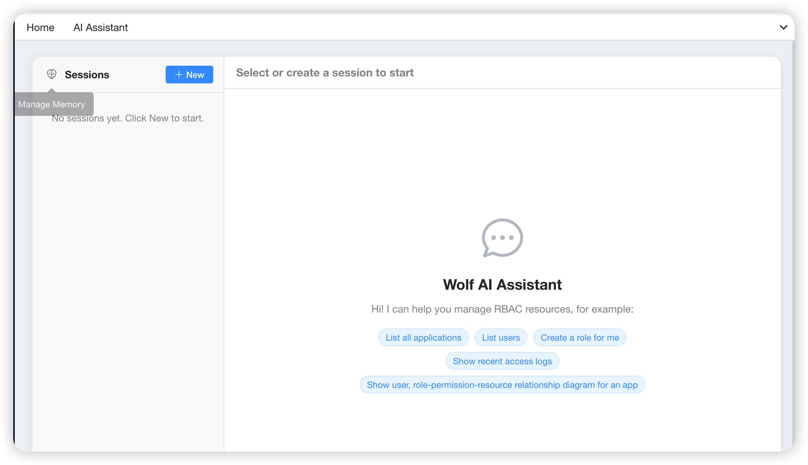
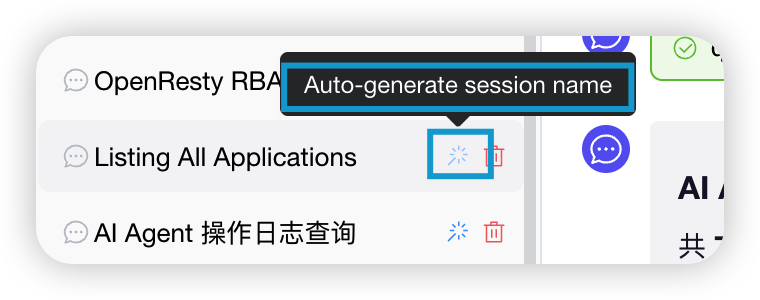
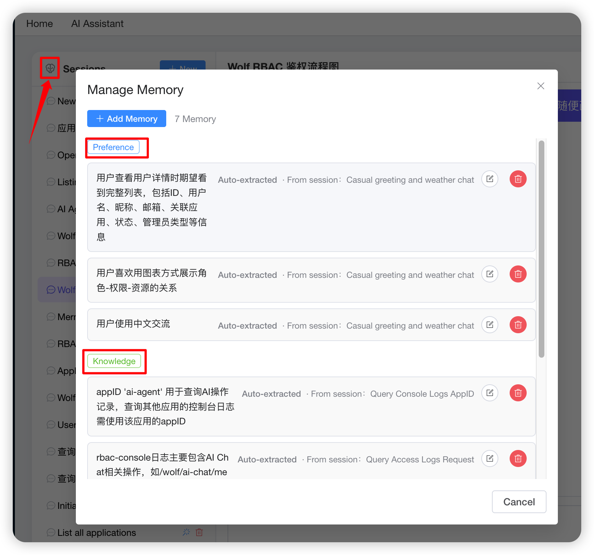
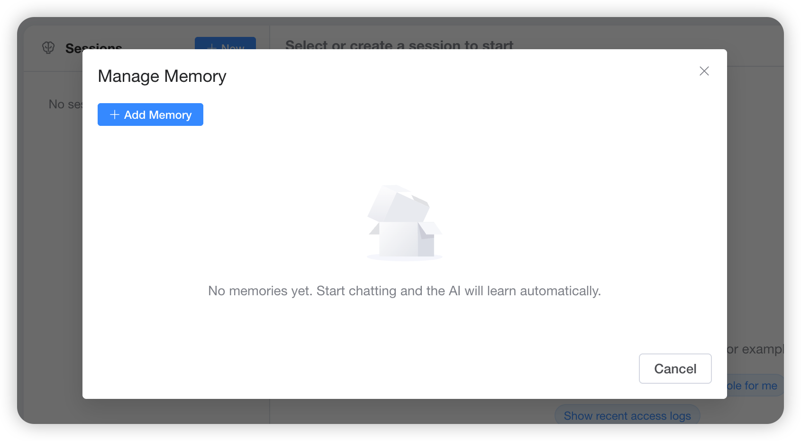
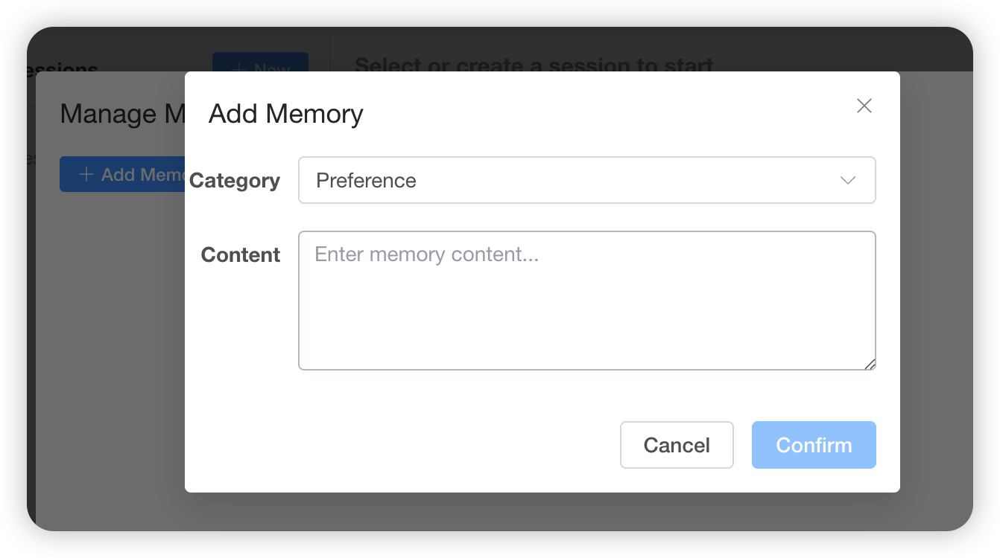
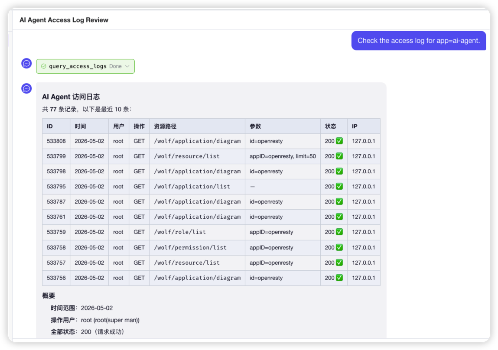

[English](ai-agent.md)

# Wolf AI Assistant 使用指南

本文档面向「想要在 Wolf 中启用并使用 AI 助手」的管理员和最终使用者。如果你只想快速了解功能概貌，请先看 [README-AI-AGENT-CN.md](../README-AI-AGENT-CN.md)。

# 目录

- [一、AI 助手能做什么](#一ai-助手能做什么)
- [二、准备工作](#二准备工作)
  - [2.1 数据库升级](#21-数据库升级)
  - [2.2 安装依赖](#22-安装依赖)
- [三、配置 AI 模型](#三配置-ai-模型)
  - [3.1 配置项一览](#31-配置项一览)
  - [3.2 各 Provider 配置示例](#32-各-provider-配置示例)
  - [3.3 API Key 解析优先级](#33-api-key-解析优先级)
  - [3.4 修改配置后无需迁移数据](#34-修改配置后无需迁移数据)
- [四、在 Console 中使用](#四在-console-中使用)
  - [4.1 进入 AI 助手页](#41-进入-ai-助手页)
  - [4.2 会话管理](#42-会话管理)
  - [4.3 用户记忆](#43-用户记忆)
- [五、工具能力清单](#五工具能力清单)
- [六、AI 操作的审计](#六ai-操作的审计)
- [七、权限模型](#七权限模型)
- [八、SSE 事件协议（前后端集成参考）](#八sse-事件协议前后端集成参考)
- [九、HTTP API 一览](#九http-api-一览)
- [十、常见问题（FAQ）](#十常见问题faq)

---

## 一、AI 助手能做什么

Wolf AI 助手是一个**内嵌在 Wolf Console 中的对话式 RBAC 管理界面**。你可以用自然语言执行：

- 查询：「`oa-app` 下有几个角色？每个角色绑了多少权限？」
- 创建：「在 `pi-mono` 下新建一个 `viewer` 角色，把所有 `read_` 开头的权限给它。」
- 修改：「把 `admin` 角色的 `delete_user` 权限去掉。」
- 删除：「把 `legacy-app` 应用删了。」（高危操作，AI 会先和你确认）
- 审计：「最近一周有哪些 `403` 的访问？」
- 复杂任务：「我要给销售团队做一组角色，分别叫 `sales-leader` / `sales-staff` / `sales-readonly`，对应的权限请你按命名习惯推一下，权限先列出来给我确认，再帮我建。」

AI 直接调用 Wolf 现有的 Controller 执行操作，**与你在 Console 上手工操作走的是完全同一套代码路径**，所有的鉴权、参数校验、审计日志一应俱全。

## 二、准备工作

### 2.1 数据库升级

AI 助手引入了 3 张新表：

| 表名 | 用途 |
|-----|-----|
| `ai_chat_session` | 一条会话（侧边栏的一行） |
| `ai_chat_message` | 一条消息（user / assistant / toolResult），内容以 JSON 形式存储 |
| `ai_user_memory` | 一条用户记忆，AI 从历史会话提取，注入下一次会话的 System Prompt |

**全新安装** Wolf：使用 `server/script/db-psql.sql`（PostgreSQL）或 `server/script/db-mysql.sql`（MySQL），已经包含上述表。

**从 0.6.x / 0.7.x 升级**：执行升级脚本中的 `upgrade to 0.8.x` 段落即可：

```bash
# PostgreSQL
psql -U wolfroot -d wolf -f server/script/db-psql-upgrade.sql

# MySQL
mysql -uwolfroot -p wolf < server/script/db-mysql-upgrade.sql
```

> 升级脚本是幂等的，对 0.6.x / 0.7.x 引入的字段不会再次执行，可以放心运行多次。如果只想升级到 0.8.x，可以打开脚本只执行 `upgrade to 0.8.x` 部分。

### 2.2 安装依赖

服务端在 `package.json` 中新增了 2 个核心依赖：

```
@mariozechner/pi-agent-core
@mariozechner/pi-ai
```

它们都是 ESM-only 的包，Wolf-Server 本身是 CommonJS，所以服务端通过动态 `import()` 加载。**前置要求：Node.js >= 18**。

执行：

```bash
cd server
pnpm install   # 或 npm install
```

> 如果使用 Docker 构建（`bin/build-all.sh`），构建脚本会在镜像中处理依赖，无需手工执行。

## 三、配置 AI 模型

### 3.1 配置项一览

所有配置都在 `server/conf/config.js` 的 `ai` 段，每一项都可以通过环境变量覆盖：

```js
ai: {
  provider:           process.env.AI_PROVIDER       || 'openai',
  model:              process.env.AI_MODEL          || 'deepseek-v4-flash',
  api:                process.env.AI_API            || 'openai-completions',
  apiKey:             process.env.AI_API_KEY        || '',
  baseUrl:            process.env.AI_BASE_URL       || '',
  maxTurns:           parseInt(process.env.AI_MAX_TURNS)       || 20,
  maxHistoryMessages: parseInt(process.env.AI_MAX_HISTORY)     || 100,
  thinkingLevel:      process.env.AI_THINKING_LEVEL || 'low',
}
```

| 字段 | 环境变量 | 默认 | 说明 |
|-----|----------|-----|------|
| `provider` | `AI_PROVIDER` | `openai` | 模型供应商：`openai` / `anthropic` / `google` / `mistral` / `groq` / `xai` / `openrouter` |
| `model` | `AI_MODEL` | `deepseek-v4-flash` | 具体模型 ID，例如 `deepseek-v4-flash`、`gpt-4o`、`claude-3-5-sonnet-20241022`、`gemini-1.5-pro`、`qwen3.5-plus` 等 |
| `api` | `AI_API` | `openai-completions` | API 协议类型。模型若在 `pi-ai` 内置注册表内会自动识别；否则使用此值作为 fallback。常用：`openai-completions`（兼容所有 OpenAI 兼容网关）、`openai-responses`（仅官方 OpenAI 新接口）、`anthropic-messages`、`google-generative-ai` |
| `apiKey` | `AI_API_KEY` | 空 | API 密钥。留空则按 provider 回退到标准环境变量（见 3.3） |
| `baseUrl` | `AI_BASE_URL` | 空 | 自定义 API 地址，用于代理、私有部署或国内中转服务。须包含版本路径，如 `https://api.deepseek.com/v1` |
| `maxTurns` | `AI_MAX_TURNS` | `20` | 单次用户消息内 AI 最多进行的交互轮次（防死循环） |
| `maxHistoryMessages` | `AI_MAX_HISTORY` | `100` | 注入到模型上下文的最近消息条数。超出会被裁剪，同时尽量保持相关上下文连贯 |
| `thinkingLevel` | `AI_THINKING_LEVEL` | `low` | 思考强度，支持 `low` / `medium` / `high`（仅对支持 thinking 模式的模型有意义） |

> ⚠️ **不要把 `api` 改成 `openai-responses`**，除非你使用的是官方 OpenAI 的新 Responses 接口。对于 dashscope / 自建 vLLM / ollama / 其它 OpenAI 兼容网关，必须用 `openai-completions`。

### 3.2 各 Provider 配置示例

**DeepSeek（默认推荐）**：

```bash
export AI_PROVIDER=openai
export AI_MODEL=deepseek-v4-flash
export AI_BASE_URL=https://api.deepseek.com/v1
export AI_API_KEY=sk-...
# AI_API 用默认值即可（openai-completions）
```

**Anthropic Claude**：

```bash
export AI_PROVIDER=anthropic
export AI_MODEL=claude-3-5-sonnet-20241022
export AI_API_KEY=sk-ant-...
export AI_API=anthropic-messages
```

**Google Gemini**：

```bash
export AI_PROVIDER=google
export AI_MODEL=gemini-1.5-pro
export AI_API_KEY=...
export AI_API=google-generative-ai
```

**阿里云 DashScope（Qwen）— OpenAI 兼容模式**：

```bash
export AI_PROVIDER=openai
export AI_MODEL=qwen-plus              # 或 qwen3.5-plus、qwen-max 等
export AI_API=openai-completions
export AI_BASE_URL=https://dashscope.aliyuncs.com/compatible-mode/v1
export AI_API_KEY=sk-...
```

**自建 vLLM / Ollama / SGLang**：

```bash
export AI_PROVIDER=openai
export AI_MODEL=qwen3.6-35b           # 你部署的模型名
export AI_API=openai-completions
export AI_BASE_URL=http://10.0.0.10:8000/v1
export AI_API_KEY=any-string            # 多数自建服务接受任意字符串
```

**OpenRouter**：

```bash
export AI_PROVIDER=openrouter
export AI_MODEL=anthropic/claude-3.5-sonnet
export AI_API_KEY=sk-or-...
```

### 3.3 API Key 解析优先级

`server/src/ai/ai-config.js` 按以下顺序解析 API Key：

1. `wolfConfig.ai.apiKey`（即 `AI_API_KEY`）——**仅当请求的 provider 与当前配置的 provider 一致时生效**
2. 对应 provider 的标准环境变量：

| Provider | 环境变量 |
|----------|---------|
| `openai` | `OPENAI_API_KEY` |
| `anthropic` | `ANTHROPIC_API_KEY` |
| `google` | `GEMINI_API_KEY` |
| `mistral` | `MISTRAL_API_KEY` |
| `groq` | `GROQ_API_KEY` |
| `xai` | `XAI_API_KEY` |
| `openrouter` | `OPENROUTER_API_KEY` |

> 这个设计兼顾两种使用习惯：在容器化环境里用 `AI_API_KEY` 统一注入；在本地开发时直接复用各 SDK 默认的环境变量。

### 3.4 修改配置后无需迁移数据

`provider` / `model` / `baseUrl` 的切换是热替换：

- 历史会话的消息内容是 provider-agnostic 的纯文本与结构化载荷，**切换模型后老会话仍然可以继续对话**。
- Token 用量统计字段（`ai_chat_message.token_usage`）保留原值，不影响新会话。
- 用户记忆（`ai_user_memory`）也是纯文本，不受模型切换影响。

## 四、在 Console 中使用

### 4.1 进入 AI 助手页

1. 登录 Wolf Console（`http://localhost:12188/` 或你部署的地址）。
2. 在左侧导航栏点击 **AI 助手**（English: *AI Assistant*；日本語: *AIアシスタント*）。
3. 进入对话页 `/ai/chat`。

|  |
|:--:|
| *左侧导航 **AI 助手** 入口；未选中会话时的欢迎文案与示例提示* |

> 若 AI 未配置（无可用 API Key），发送消息时会得到友好错误提示，请管理员检查模型配置（`AI_API_KEY`、模型名、`baseUrl`）。Console 其它功能不受影响。

|  |
|:--:|
| *未配置 AI 模型 / API Key 时的错误提示* |

### 4.2 会话管理

左侧 **Sessions** 面板：

- **新建**：点击「新建」按钮，或直接在右侧输入框发送消息（不选会话时会自动建一个，标题取消息前 20 个字符）。
- **切换**：点击任意会话即可加载历史消息。
- **重命名**：右键 / 操作按钮 → 重命名；也可以让 AI 根据对话内容自动生成更贴切的标题（「✨ 自动命名」）。
- **删除**：软删除（`status=0`），会一并删除该会话的所有消息。

每个会话只属于当前登录用户。

|  |
|:--:|
| *左侧多条历史会话，选中态在右侧展示完整对话* |

|  |
|:--:|
| *悬停魔棒图标，可根据对话内容自动生成会话标题* |

### 4.3 用户记忆

侧边栏底部「💾 记忆管理」打开记忆面板。记忆分为 4 类：

| 分类 | 含义 | 示例 |
|-----|------|------|
| `preference` | 用户偏好 | 「喜欢用表格展示查询结果」/「总是用中文」 |
| `knowledge` | 已知信息（关于系统的事实） | 「OA 系统的 appID 是 `oa-app`」/「`admin` 角色拥有 X、Y、Z 权限」 |
| `decision` | 历史决策 | 「决定把用户 A 从角色 R 中移除」 |
| `pattern` | 操作模式 | 「经常查询 `oa-app` 的权限配置」 |

工作流：

1. **自动提取**：每次新建会话时，后台异步分析「上一次会话」，调用 LLM 提取 0-N 条新的记忆条目，同时把已经过时的旧记忆标记为废弃。
2. **手动管理**：你可以在面板里直接 **新增 / 编辑 / 删除** 记忆条目。
3. **注入下一次对话**：下次 Agent 启动时，所有 `status=1` 的记忆会按分类拼装进 System Prompt。

> 记忆完全按 `userID` 隔离，不会跨用户共享。

|  |
|:--:|
| *记忆面板：按分类展示，带来源标签（自动提取 / 手动添加）* |

|  |
|:--:|
| *空状态：「No memories yet. Start chatting and the AI will learn automatically.」* |

|  |
|:--:|
| *手动添加记忆：选择分类并填写内容* |

## 五、工具能力清单

下表列出全部 31 个工具。**括号中标 `[super]` 的工具只对 `super` 用户开放**，`admin` 用户会被自动过滤掉。

### Application（6 个）

| 工具 | 作用 | 备注 |
|------|------|------|
| `list_applications` | 查询应用列表 | 支持 `key` / `page` / `limit` |
| `get_application` | 应用详情 | |
| `create_application` `[super]` | 创建应用 | 唯一 `id`，可设 OAuth2 `secret` |
| `update_application` `[super]` | 更新应用 | 名称 / 描述 |
| `delete_application` `[super]` | 删除应用 | **高危**，会清掉应用下所有 RBAC 数据 |
| `get_rbac_diagram` | 拉取应用的 RBAC 关系图数据 | 配合 Mermaid 可视化 |

|  |
|:--:|
| *示例：应用的用户–角色–权限关系图* |

|  |
|:--:|
| *示例：RBAC 鉴权流程 Mermaid 流程图* |

|  |
|:--:|
| *示例：查询结果以 Markdown 表格呈现* |

### User（5 个）

| 工具 | 作用 | 备注 |
|------|------|------|
| `list_users` | 查询用户列表 | `admin` 只能看到自己管辖的应用下的用户 |
| `create_user` `[super]` | 创建用户 | 密码可自动生成 |
| `update_user` `[super]` | 更新用户 | 含 `manager` 字段切换为管理员 |
| `delete_user` `[super]` | 删除用户 | **高危** |
| `reset_user_password` `[super]` | 重置密码 | 返回新生成的随机密码 |

### Role（4 个） / Permission（4 个） / Resource（4 个） / Category（4 个）

均提供 `list_xxx` / `create_xxx` / `update_xxx` / `delete_xxx`，参数遵循 Console 同名表单，详见对应工具文件 `server/src/ai/tools/*.js`。

### UserRole（3 个）

| 工具 | 作用 | 备注 |
|------|------|------|
| `get_user_roles` | 获取用户在某应用下的角色和直接权限 | |
| `set_user_roles` | 设置用户在某应用下的角色 / 权限 | **覆盖式**，传空数组会清空 |
| `delete_user_roles` | 解除用户与某应用的全部关联 | |

### AccessLog（1 个）

| 工具 | 作用 | 备注 |
|------|------|------|
| `query_access_logs` | 查询审计日志 | `appID="ai-agent"` 可查 AI 自身操作记录 |

---

## 六、AI 操作的审计

AI 通过 `InternalCaller` 调用 Controller 时会写入一条 `access_log` 记录，关键字段：

| 字段 | AI 操作 | 人工操作 |
|------|--------|---------|
| `appID` | `'ai-agent'` | 实际应用 ID（如 `wolf-console`） |
| `userID` / `username` | 实际登录用户 | 同 |
| `action` | HTTP 方法 | 同 |
| `resName` | 工具内部调用的路径，如 `/wolf/role` | URL Path |
| `body` | 工具参数 | 请求 body |

查询 AI 的全部操作：在 Console 的「审计日志」页面，**Application** 选择 `ai-agent`；或者在 AI 中直接问：「最近 1 天 `ai-agent` 都做了什么？」

|  |
|:--:|
| *让助手查询 `appID=ai-agent` 的访问日志；工具调用与结果 inline 展示* |

## 七、权限模型

| 项 | 行为 |
|---|-----|
| 是否需要登录 | ✅ 强制要求登录（`token-check` 中间件保证） |
| 谁能用 | 任何能登录 Console 的用户（含 `super` / `admin`） |
| AI 能调哪些工具 | 与当前登录用户的 `manager` 字段绑定。`admin` 用户看不到 `super`-only 工具列表，模型不会尝试调用它们 |
| AI 能否提权 | ❌ 不能。即使模型尝试调一个 `super`-only 工具，工具本身在 `getAllTools()` 阶段就被过滤掉了 |
| AI 能否绕过 Controller 鉴权 | ❌ 不能。所有调用都经过 `InternalCaller` → `Controller.access()` |
| 跨用户能否看到对方的会话 / 记忆 | ❌ 不能。`ai_chat_session.userID` / `ai_user_memory.userID` 严格隔离 |

## 八、SSE 事件协议（前后端集成参考）

`POST /wolf/ai-chat/chat` 返回 `Content-Type: text/event-stream`，每条事件格式为 `data: {json}\n\n`。

事件类型：

| `type` | 触发时机 | 关键字段 |
|--------|---------|----------|
| `session_created` | 自动创建新会话时 | `sessionId` |
| `agent_start` | Agent 开始处理本轮 | — |
| `message_start` | 新一条 `assistant` / `user` / `toolResult` 消息开始流式输出 | `message` |
| `message_update` | 流式 token 增量 | `message`、`event` |
| `message_end` | 单条消息流结束 | `message` |
| `done` | 整个 Agent 轮次结束 | `tokenUsage`（input / output / cost） |
| `error` | 任意阶段出错 | `error`（人类可读字符串） |

前端可参考 `console/src/api/ai-chat.ts` 中的 `chatStream` 函数（基于原生 `fetch + ReadableStream` 的 AsyncGenerator）。

## 九、HTTP API 一览

所有 AI 接口均在 `service = ai-chat` 下（控制器 `server/src/controllers/ai-chat.js`）：

| Method | Path | 用途 |
|--------|------|-----|
| `POST` | `/wolf/ai-chat/chat` | SSE 流式对话（核心接口） |
| `GET` | `/wolf/ai-chat/sessions` | 当前用户的会话列表 |
| `POST` | `/wolf/ai-chat/createSession` | 创建新会话（并触发记忆提取） |
| `DELETE` | `/wolf/ai-chat/deleteSession` | 删除会话（软删） |
| `PUT` | `/wolf/ai-chat/renameSession` | 重命名会话 |
| `GET` | `/wolf/ai-chat/messages` | 会话的历史消息 |
| `POST` | `/wolf/ai-chat/autoRenameSession` | 让 AI 总结生成会话标题 |
| `GET` | `/wolf/ai-chat/memories` | 当前用户的记忆列表 |
| `POST` | `/wolf/ai-chat/memory` | 手动添加一条记忆 |
| `PUT` | `/wolf/ai-chat/memory` | 编辑一条记忆 |
| `DELETE` | `/wolf/ai-chat/memory` | 删除一条记忆 |

请求都要求 `x-rbac-token`（Console 已有 token 复用）。响应体格式与 Wolf 其它接口一致：`{ ok, reason?, errmsg?, data? }`。

## 十、常见问题（FAQ）

**Q1. 打开 AI 助手页报 503 / `AI_NOT_CONFIGURED`？**

A：服务端没读到可用的 API Key，或模型调用失败。发送消息后会看到：「AI returned no content. Please ask an administrator to check the model configuration (model name, API key, baseUrl).」检查：
- 是否设置了 `AI_API_KEY`（且当前 `AI_PROVIDER` 与之匹配）；
- 或者是否设置了 provider 对应的标准环境变量（如 `OPENAI_API_KEY`、`ANTHROPIC_API_KEY`）。
- 设置后重启 `server`。

**Q2. AI 一直转圈不返回内容？**

A：常见原因：
- `baseUrl` 配错（指向不可达的网关）；
- `model` 名在你选的 provider 上不存在（OpenAI 兼容网关下，`pi-ai` 会用 fallback model 构造，仍要保证网关接受这个 `model` 字段）；
- 网关上你的 API Key 没有该模型的调用权限。
- 查看服务日志（`log4js`），关键字 `[AgentFactory]`、`[ai-chat]` 会有详细信息。

**Q3. AI 回复中出现 `<think>...</think>` 文本？**

A：部分模型（如 DeepSeek-R1、Qwen-thinking 系列）会输出思考过程。服务端的 `sanitize-message.js` 会在发送给前端前剥离这些段落；如果你仍看到，请确认模型输出格式与预期一致，可以提 issue 反馈。

**Q4. 想让 AI 不要执行写操作（只查询）怎么做？**

A：当前实现按用户 `manager` 字段裁剪工具集。如需「只读模式」，可临时把用户 `manager` 字段改成 `null`（普通用户）——普通用户仍可查询，但无法执行写入类工具。

**Q5. AI 返回结果太长被截断？**

A：默认 `maxHistoryMessages = 100`，超过会裁剪最早的消息，同时尽量保持上下文连贯。如果单次响应特别大，建议让 AI 用 `key`、`page`、`limit` 缩小查询范围。

**Q6. 多人同时用 AI 会不会串数据？**

A：不会。`ai_chat_session.userID` / `ai_user_memory.userID` 严格按 token 中的用户 ID 隔离；SSE 流是单次请求级别的；Agent 实例每个对话回合现建现销，不存在跨用户/跨会话的全局状态。

**Q7. 想换模型试一下，会丢历史会话吗？**

A：不会。消息和记忆都是文本格式，与 provider 无关。直接修改环境变量重启即可。

**Q8. AI 操作和 Console 手工操作在审计日志里如何区分？**

A：看 `appID` 字段：AI 操作恒为 `ai-agent`，Console 手工操作为目标应用的真实 `appID`（如 Console 自己是 `wolf-console`，业务应用是各自的 ID）。

---

[Back to TOC](#目录)
