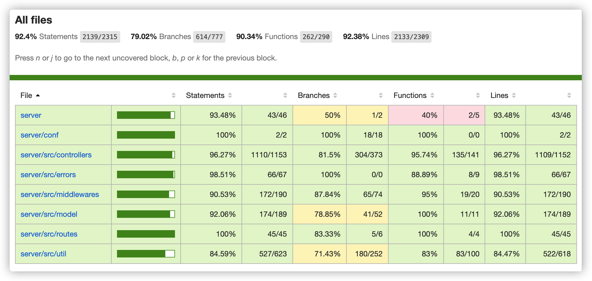
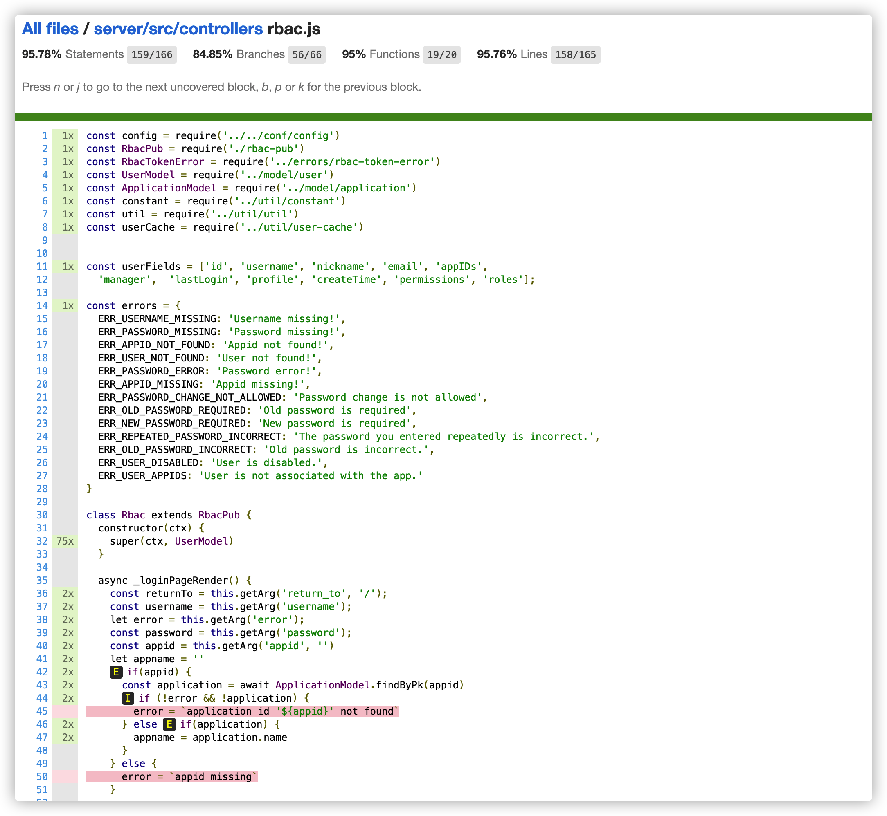

### 执行单元测试

单元测试目前仅对服务器API接口部分. 执行如下命令,进行单元测试:

```
cd wolf/server
npm run test
```

执行完成后, 如果测试都成功, 输出大概如下:

```
➜  server git:(master) ✗ npm run test

> wolf-server@0.1.0 test
> ./node_modules/.bin/nyc --reporter=html mocha test/*.test.js --exit --timeout 10000

  framework
    router
user [root] is exist!
      ✔ ping (38ms)
      ✔ not found 001 (286ms)
user [admin] is exist!
      ✔ not found 002 (44ms)
      ✔ request internal method start with _ (68ms)
    token check
      ✔ token missing
      ✔ token invalid
      ✔ token ok (51ms)

    ......

      ✔ userInfo success by refreshTokenInfo1.access_token (59ms)
      ✔ access check success by refreshTokenInfo1.access_token (100ms)
      ✔ userInfo failed, token expired (2019ms)
      ✔ token by password success (102ms)
      ✔ access check failed, token missing
      ✔ access check success (52ms)
      ✔ token by password failed, User not found (41ms)
      ✔ token by password failed, Password is incorrect (179ms)
      ✔ token by client_credentials success
      ✔ userInfo success by clientCredentialsTokenInfo.access_token
    rbac-destroy
      ✔ application (58ms)
      ✔ category (54ms)
      ✔ permission (40ms)
      ✔ role
      ✔ user (530ms)
      ✔ resource


  317 passing (36s)
```

单元测试全部执行完成后,会在`server/coverage`生成覆盖率报告. 目前的代码语句覆盖率在`92%`左右.

|  |
|:--:|
| *覆盖率-概览* |


|  |
|:--:|
| *覆盖率-详情* |

